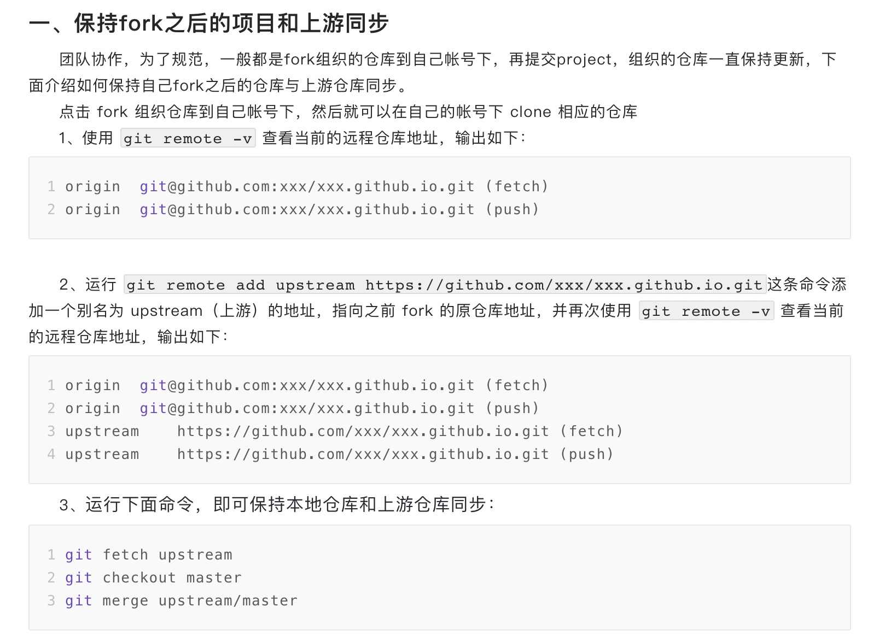

# 极客大学「Python进阶训练营 」作业提交仓库

## 仓库目录结构说明

1. `Week_01/` 代表第一周作业提交目录，以此类推。
2. `Week_01/G20200343030189`代表学号为 `G20200343030189` 的学员第一周的作业提交目录，以此类推。
3. 每个目录下面均有一个 `NOTE.md` 文档，你可以将自己当周的学习心得以及做题过程中的思考记录在该文档中（该项不属于作业内容，是可选项）。

## 作业提交规则

### 项目代码作业的提交
1. 先将本仓库 `fork` 到自己的 GitHub 账号下。

2. 将 `fork` 后的仓库 `clone` 到本地，然后在本地新建、修改自己的代码作业文件，**注意：** 仅允许在和自己学号对应的目录下新建或修改自己的代码作业。作业完成后，将相关代码 `push` 到自己的 GitHub 远程仓库。

3. 提交 `Pull Request` 给本仓库，Pull 作业时，必须备注自己的学号和提交第几周的作业，如`G20200343030189-Week 02`，是指学号为`G20200343030189`的学员提交的`第二周`的代码作业。

4. 代码文件命名规则：**学习周_学号_ex.py,比如学号为0189的学员完成第二周的项目作业后，请将代码文件名保存为 week02_0189_ex.py。(ex是 example的意思，标题示例)

5.  务必按照Pull Request的备注形式和作业文件的命名进行提交，班主任会严格按照命名形式统计大家的作业。 

   #### 如何保持fork之后的项目和上游同步

   
