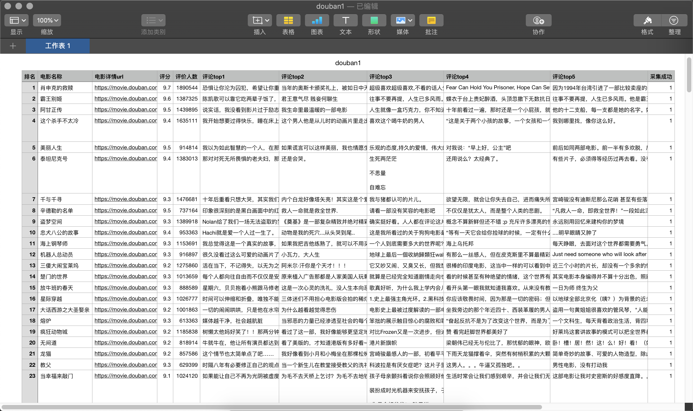

# 学习笔记

## 作业 1

[week01_0137_ex.py](./week01_0137_ex.py)

采集豆瓣电影 top250 相关信息

先采集概要信息（按序采集）：包括电影名称、详情 url、评分、评论人数，进行保存

再采集详情页面（待后续改进为并发采集）：包括热门 top5 评论，标记采集成功失败，以便对失败的进行核查或再进行复采

待改进：

1、使用代理池
2、并发采集详情页
3、数据采集与数据写入分离

爬取结果如下图所示：

1、使用代理池
2、并发采集详情页
3、数据采集与数据写入分离



## 作业 2

[hping.py](./hping.py)

## 学习目标

- 掌握高效系统学习 Python 的方法
- 提升 Python 开发效率的工具
- 复习基础 Python 语法

## 课程介绍

1. 完整案例：NLP 舆情系统

    需求描述-数据收集-数据处理-语料处理-深度学习-结果测评-调参-展示

2. Python 底层功能

   - 作用域问题
   - 面向对象编程
   - 多线程、协程
   - 爬虫框架、Web 框架

## 绪论

### 为什么学习 Python

1. Python 语言足够流行
2. Python 语言足够“简单”
3. 生态完善

### Python 作为第二语言

1. 作为第二语言可以做知识迁移
2. 前端开发可以从爬虫项目开始无痛入手
3. 后端开发可以对比静态语言和动态语言的差异

### 高效学习 Python 的方法

1. 建立高效的学习模型
2. 了解 Python 的长处
3. 了解 Python 的特性
4. 官方文档你必须玩的溜
5. 深度阅读空（GitHub），阅读高手代码
6. 好的问题是成功的一版（Google、Stack Overflow）
7. 风格指引（PEP8、Google Python Style Guides）

### 提升 Python 开发效率的工具

1. VSC：高效的 IDE
    - pylint
    - autopep8
    - remote-ssh
2. Python3.6 or Python3.7：不同的版本差别在哪里？
3. Jupyter Notebook：数据科学家的最爱
4. git

>阅读 3.6、3.7、3.8 变化

### 从一个需求开始

获取豆瓣读书 Top250 的书籍名字和评分：<https://book.douban.com/top250>

### 实现

步骤：

1. F12 调试模式分析网页源代码
2. 用 Request（底层依赖 urllib3）爬取网页全部内容；
3. 用 Beautiful Soup 解析网页提取关键信息
4. 用 csv 文件存储书籍名字和评分

```python
import requests
from bs4 import BeautifulSoup as bs

def get_url_name(myurl):
    # headers = {
    #     'User-Agent': 'Mozilla/5.0 (Macintosh; Intel Mac OS X 10_15_3) AppleWebKit/537.36 (KHTML, like Gecko) Chrome/80.0.3987.116 Safari/537.36'
    #     }

    userAgent = 'Mozilla/5.0 (Macintosh; Intel Mac OS X 10_15_3) AppleWebKit/537.36 (KHTML, like Gecko) Chrome/80.0.3987.116 Safari/537.36'
    headers = {}
    headers['User-Agent'] = userAgent
    response = requests.get(url=myurl, headers=headers)
    #print(response)
    bs_info = bs(response.text, 'html.parser')        # lxml
    # print(type(bs_info))

    #k = bs_info.find_all('div', attrs={'class':'pl2'})      # 匹配到<div class="pl2">。。。。。。</div>
    #print(k)

    for tags in bs_info.find_all('div', attrs={'class':'pl2'}):
        # a_tag = tags.contents[1]      # 获取 a 标签
        # print(a_tag)
        for atag in tags.find_all('a', ):   # tags 继承 bs，也可以用方法
            print(atag.get('href'))     # 获取所有连接
            print(atag.get('title'))    # 获取图书的名字

urls =tuple(f'https://book.douban.com/top250?start={page * 25}' for page in range(10))

from time import sleep

if __name__ == "__main__":
    for page in urls:
        get_url_name(page)
        sleep(5)
```

### pip 加速器

国内常见的镜像站：

- 豆瓣：<http://pypi.doubanio.com/simple/>
- 清华：<https://mirrors.tuna.tsinghua.edu.cn/help/pypi/>

升级 pip：

- 方法一：`pip install -i https://pypi.tuna.tsinghua.edu.cn/simple pip -U`
- 方法二：`pip config set global.index-url http://pypi.doubanio.com/simple/; pip install pip -U`

### pip 安装加速

配置文件：

- Windows：c:\Users\xxx\pip\pip.ini
- Linux: ~/.pip/pip.conf

配置文件格式：

```ini
[global]
index-url = [https](https://pypi.tuna.tsinghua.edu.cn/simple)
```

### 翻页都是怎么做到的

`https://search.bilibili.com/all?keyword=%E7%8E%8B%E8%80%85%E8%8D%A3%E8%80%80%E9%B2%81%E7%8F%AD%E5%A4%A7%E5%B8%88&from_source=nav_search_newhttps://search.douban.com/book/subject_search?search_text=python&cat=1001`

`https://weibo.com/a/aj/transform/loadingmoreunlogin?ajwvr=6&category=0&page=7&lefnav=0&cursor=&__rnd=1575299380621https://weibo.com/a/aj/transform/loadingmoreunlogin?ajwvr=6&category=0&page=8&lefnav=0&cursor=&__rnd=1575299407336`

>S1 注：
>get 或 post 带有下一页的参数，爬虫时找出规律

### 格式化字符串

三种常用的格式化字符串方法：

1. % 操作符
2. str.format(*args, **kargs)
3. f-string：Python3.6 引入，该方法源于 PEP498

#### % 操作符 -- printf 风格的字符串格式化

```python
import math
print('The value of Piis approximately %5.3f.' % math.pi)
# 输出：The value of Piis approximately 3.142.格式化字符串
```

#### .format -- 更加灵活

```python
print('{1} and {0}'.format('spam', 'eggs’))
# 输出：eggs and spam

print('The story of {0}, {1}, and {other}.'.format('Bill', 'Manfred',     other='Georg'))
# 输出：The story of Bill, Manfred, and Georg.
```

参考：<https://docs.python.org/zh-cn/3.6/library/string.html#formatstring>

#### f-string

Python3.6 引入，该方法源于 [PEP498](https://docs.python.org/zh-cn/3.6/whatsnew/3.6.html#whatsnew36-pep498)。

f-string 与 %操作符、format 比较：

1. 性能更好
2. 易读性更好

三种写法比较：

```python
firstname= 'yin'
lastname= 'wilson'
print('Hello, %s %s.' % (lastname, firstname))
print('Hello, {1} {0}.'.format(firstname, lastname))
print(f'Hello, {lastname} {firstname}.')
```

f-string 还可以做其他事情：

```python
# 可以直接进行计算
f'{ 2 * 5 }'

# 可用于类中定义str、repr
class Person:
    def __init__(self, first_name, last_name):
        self.first_name = first_name
        self.last_name = last_name
    def __str__(self):
        return f'hello, {self.first_name} {self.last_name}.'
    def __repr__(self):
        return f'hello, {self.first_name} {self.last_name}.'

me = Person('yin', 'wilson')
print(f'{me}'
```

str 与 repr：

- str：用于给人看，3 种场景：交互模式str()、print()、str.format())，
- repr：用于程序间

>S1注：
>类如果定义了 repr 而没有定义 str，会使用 repr，可能会导致与预想的输出不一致，要知道

```python
>>> s = 'string'
>>> s
'string'
>>> str(s)
'string'
>>> repr(s)
"'string'"
```

```python
>>> from datetime import datetime
>>> datetime.today()
datetime.datetime(2020, 3, 1, 9, 3, 29, 720013)
>>> str(datetime.today())
'2020-03-01 09:03:48.124500'
>>> repr(datetime.today())
'datetime.datetime(2020, 3, 1, 9, 3, 59, 172143)'
```

类似的：

- a += b 和 a = a + b 有什么不一样
- list 与 [] 有什么不一样

## 复习 Python 基础知识

- 赋值使用 “=” 符号
- Python3.8 会引入海象运算符“:=” （PEP572）
- 赋值前不需要指定类型（分配内存）
- 数值、布尔、字符串、序列赋值前不需要指定类型（分配内存）

```python
# 没有海象运算符之前
len(a)
if (len(a)>10):
    pass
n=len(a)
if (n>10):
    pass

# 使用海象运算符 ':='
if( n := len(a) ) >10:
    pass
```

### 基本数据类型

|数据类型|说明|
|-|-|
|None|空对象|
|Bool|布尔值|
|数值|整数、浮点数、复数|
|序列|字符串、列表、元组|
|集合|字典|
|可调用|函数|

要掌握：

- 内置函数：<https://docs.python.org/zh-cn/3.6/library/functions.html>
- 内置类型：<https://docs.python.org/zh-cn/3.6/library/stdtypes.html>
- 主要内置类型有数字、序列、映射、类、实例和异常。自己划分一下

|<div style="width:80px">类型</div>|内置函数|
|-|-|
|作用域|gloabs、locals|
|数值|abs、bin、complex、divmod、float、hex、int、oct、pow、round、sum|
|字符|ascii、bytes、chr、eval、format、hash、ord、repr、str|
|布尔|bool|
|序列|all、any、bytearray、delattr、enumerate、frozenset、getattr、hasattr、iter、max、min、next、range、reversed、set、setattr、slice、sorted、tuple、vars|
|映射|filter、map、zip|
|类|@classmethod、frozenset、isinstance、issubclass、memoryview、object、property、staticmethod、super|
|实例|callable|
|异常|-|
compile、dir、exec、help、id、input、len、open、print、type、__import__

>S1注：可以使用 dir、help、dis 模块来分析研究这些功能。

```python
alist = ['a', 'b', 'c']
dir(alist)
help(alist)

>>> import dis
>>> dis.dis('alist')
  1           0 LOAD_NAME                0 (alist)
              2 RETURN_VALUE
```

alist.sort()  sorted(alist) # 有什么区别，尽量用 python 原生功能，性能高：

```python
>>> import timeit
>>> timeit.timeit('list(i for i in range(100))')
7.009529987000008
>>> timeit.timeit('[i for i in range(100)]')
4.4208041439999874
```

list dict有函数调用动作 ，有栈操作，比[]{}要慢，通过dis模块可以看字节码看出执行过程的区别

### 循环控制

|类型|语法结构|
|-|-|
|条件语句|if...else...|
|循环语句|for...in，while...|
|导入库、包、模块|import|

注意：Python 使用缩进作为语句块的分隔

### Python 的执行方法

```sh
shell> python filename.py
```

Python 会将 .py 文件编译成字节码 pyc 格式文件，由 Python 虚拟机执行

```sh
shell> python
python>>> import whatyouwant
python>>> run python something
```

交互模式（解释执行）

## 总结

1. 通过静态页面爬虫复习了 Python 的基础语法
2. 了解 Python 语言作为动态语言的特点
3. 掌握静态页面数据收集的一般方法
