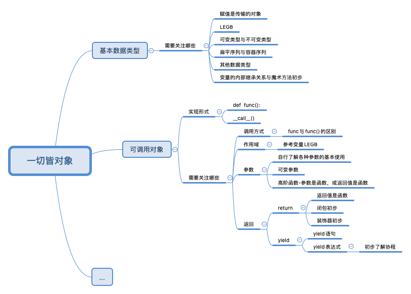
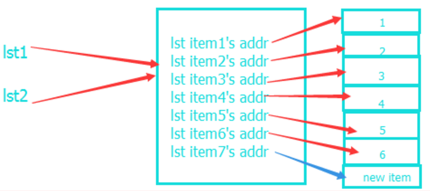
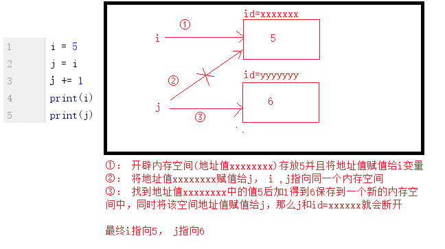
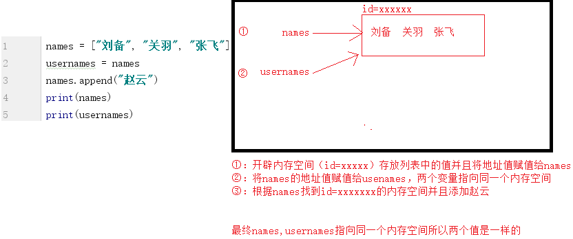
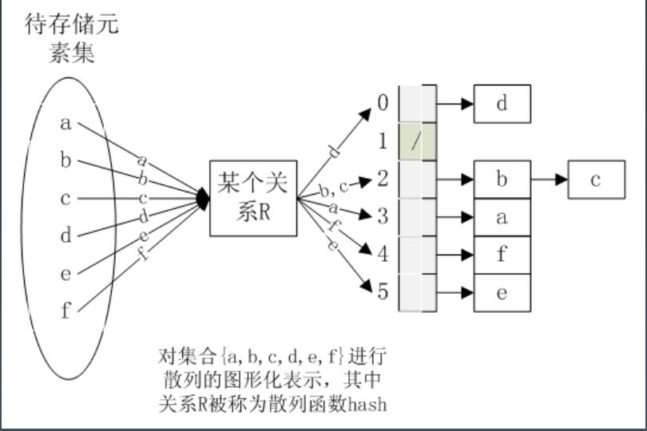

# 2020.03.07 第三讲：面向对象与设计模式



## 学习目标

- 掌握Python变量和函数底层原理
- 掌握高效的数据结构

## 数据结构

<https://docs.python.org/zh-cn/3.8/reference/datamodel.html>

### 变量的引用

命名问题：

- 关键字
  - import keyword
  - keyword.kwlist
- 避免的名称
  - 单字符名称，除了计数器和迭代器
  - 包/模块名中的连子符（-）
  - 双划线开头并结尾的名称（Python 保留，例如 __init__）

建议命名规范：

|Type|Public|Internal|
|-|-|-|
|Packages|lower_with_under|-|
|Modules|lower_with_under|_lower_with_under|
|Classes|CapWords|_CapWords|
|Exceptions|CapWords|-|
|Functions|lower_with_under()|_lower_with_under()|
|Global/Class Constants|CAPS_WITH_UNDER|_CAPS_WITH_UNDER|
|Global/Class Variablesi|lower_with_under|_lower_with_under|
|Instance Variables|lower_with_under|_lower_with_under(protected) or __lower_with_under(privite)|
|Method Names|lower_with_under()|_lower_with_under(protected) or __lower_with_under(privite)|
|Function/Method Parameters|lower_with_under|-|
|Local Varaibles|lower_with_under|-|

入口：

```python
def main():
    pass

if __name__ == '__main__':
    main()
```

### 变量赋值

变量存储的是值所在的内存地址

最后一行打印出变量b的内容到底是 'ABC' 呢还是 'XYZ' ？

```python
a = 'ABC'
b = a
a = 'XYZ'
print(b)
```

如果从数学意义上理解，就会错误地得出b和a相同，也应该是'XYZ'，但实际上b的值是'ABC'，让我们一行一行地执行代码，就可以看到到底发生了什么事：

执行a = 'ABC'，解释器创建了字符串'ABC'和变量a，并把a指向'ABC'：


执行b = a，解释器创建了变量b，并把b指向a指向的字符串'ABC'：


执行a = 'XYZ'，解释器创建了字符串'XYZ'，并把a的指向改为'XYZ'，但b并没有更改：


所以，最后打印变量b的结果自然是'ABC'了。

复杂数据结构的赋值：



理解下面示例：

```python
>>> a = 123
>>> b = 123
>>> c = a
>>> c
123
>>> id(a)
4309943216
>>> id(b)
4309943216
>>> id(c)
4309943216
# 一个特例：<https://github.com/leisurelicht/wtfpython-cn#-is-is-not-what-it-is%E5%87%BA%E4%BA%BA%E6%84%8F%E6%96%99%E7%9A%84is>

>>> a = 456
>>> c = 789
>>> id(a)
4313144016
>>> id(b)
4309943216
>>> id(c)
4313144112

>>> c = b = a
>>> a
456
>>> b
456
>>> c
456
>>> id(a)
4313144016
>>> id(b)
4313144016
>>> id(c)
4313144016
>>>
```

问题 1：传值还是传对象引用（址）？传的是值，给值分配内存地址空间，变量名指向内存地址

### 基本数据类型的可变类型与不可变类型区分

可变还是不可变是从是否开辟新的内存空间上来说，改变对象的值，如果内存地址发生变化就是不可变类型，如果内存地址不发生变化就是可变类型（原地改变值）

- 不可变类型：字符串、字节串、元组
- 可变类型：列表、字节列表、扩展模块array、collections、字典

不可变类型传对象， 可变类型传对象的引用

不可变类型优点：不管有多少引用 ，相同对象只占用一块内存

不可变类型缺点 对变量改变要先创建对象

可变类型 值变化不会新建对象，地址不会变，只是地址中的内容变了，地址得到扩充

不可变类型执行过程内存分析：



可变类型执行过程内存分析：



```python
>>> a = [1, 2, 3]
>>> b = a
>>> a
[1, 2, 3]
>>> b
[1, 2, 3]
>>> id(a)
4395957384
>>> id(b)
4395957384
>>>

>>> a.append(4)
>>> a
[1, 2, 3, 4]
>>> b
[1, 2, 3, 4]
>>> id(a)
4395957384
>>> id(b)
4395957384
>>>
```

变成传址，可变数据类型，首地址不变，传对象的引用

不可变数据类型，传对象引用值

```python
>>> a = [1, 2, 3]
>>> b = a
>>> a
[1, 2, 3]
>>> b
[1, 2, 3]
>>> id(a)
4466220104
>>> id(b)
4466220104
>>>

>>> a = [4, 5, 6]
>>> a
[4, 5, 6]
>>> b
[1, 2, 3]
>>> id(a)
4467428488
>>> id(b)
4466220104
>>>
```

```python
>>> a = [1, 2, 3]
>>> b = a
>>> a
[1, 2, 3]
>>> b
[1, 2, 3]
>>> id(a)
4562345096
>>> id(b)
4562345096
>>>

>>> a[0], a[1], a[2] = 4, 5, 6
>>> a
[4, 5, 6]
>>> b
[4, 5, 6]
>>> id(a)
4562345096
>>> id(b)
4562345096
>>>
```

思考哪种类型可以做字典的 key？为什么?

不可变类型做 key

### 深拷贝、浅拷贝

- 直接赋值：其实就是对象的引用（别名）。
- 浅拷贝(copy)：拷贝父对象，不会拷贝对象的内部的子对象。
- 深拷贝(deepcopy)： copy 模块的 deepcopy 方法，完全拷贝了父对象及其子对象。
- 不可变容器（数字、字符串、元组）类型没有拷贝

浅拷贝：不管多么复杂的数据结构，浅拷贝都只会copy一层（为第一层开辟新的内存空间）。

深拷贝：为所有层开辟新的内存空间

```python
import copy
copy.copy(object)
copy.deepcopy(object)
```

```python
#!/usr/bin/env python
# 容器序列的拷贝问题

old_list = [i for i in range(1, 11)]
new1_list = old_list
new2_list = list(old_list)
new3_list = old_list[:]     # 切片操作


print(f'old_list={old_list}')
print(f'new1_list={new1_list}')
print(f'new2_list={new2_list}')
print(f'new3_list={new3_list}')
# 输出结果
# old_list=[1, 2, 3, 4, 5, 6, 7, 8, 9, 10]
# new1_list=[1, 2, 3, 4, 5, 6, 7, 8, 9, 10]
# new2_list=[1, 2, 3, 4, 5, 6, 7, 8, 9, 10]
# new3_list=[1, 2, 3, 4, 5, 6, 7, 8, 9, 10]

print(f'old_list_id={id(old_list)}')
print(f'new1_list_id={id(new1_list)}')
print(f'new2_list_id={id(new2_list)}')
print(f'new3_list_id={id(new3_list)}')
# 输出结果
# old_list_id=4455841608
# new1_list_id=4455841608
# new2_list_id=4457769864
# new3_list_id=4455841672

old_list.append([11, 12])   # 嵌套对象
print(f'old_list={old_list}')
print(f'new1_list={new1_list}')
print(f'new2_list={new2_list}')
print(f'new3_list={new3_list}')
# 输出结果
# old_list=[1, 2, 3, 4, 5, 6, 7, 8, 9, 10, [11, 12]]
# new1_list=[1, 2, 3, 4, 5, 6, 7, 8, 9, 10, [11, 12]]
# new2_list=[1, 2, 3, 4, 5, 6, 7, 8, 9, 10]
# new3_list=[1, 2, 3, 4, 5, 6, 7, 8, 9, 10]

print(f'old_list_id={id(old_list)}')
print(f'new1_list_id={id(new1_list)}')
print(f'new2_list_id={id(new2_list)}')
print(f'new3_list_id={id(new3_list)}')
# 输出结果
# old_list_id=4455841608
# new1_list_id=4455841608
# new2_list_id=4457769864
# new3_list_id=4455841672


import copy
new4_list = copy.copy(old_list)
new5_list = copy.deepcopy(old_list)
print(f'old_list={old_list}')
print(f'new4_list={new4_list}')
print(f'new5_list={new5_list}')
# 输出结果
# old_list=[1, 2, 3, 4, 5, 6, 7, 8, 9, 10, [11, 12]]
# new4_list=[1, 2, 3, 4, 5, 6, 7, 8, 9, 10, [11, 12]]
# new5_list=[1, 2, 3, 4, 5, 6, 7, 8, 9, 10, [11, 12]]

print(f'old_list_id={id(old_list)}')
print(f'new4_list_id={id(new4_list)}')
print(f'new5_list_id={id(new5_list)}')
# 输出结果
# old_list_id=4455841608
# new4_list_id=4457771656
# new5_list_id=445777056

assert new4_list == new5_list #True
assert new5_list is new5_list #False AssertionError

old_list[10][0] = 13
print(f'old_list={old_list}')
print(f'new4_list={new4_list}')
print(f'new5_list={new5_list}')
# 输出结果
# old_list=[1, 2, 3, 4, 5, 6, 7, 8, 9, 10, [13, 12]]
# new4_list=[1, 2, 3, 4, 5, 6, 7, 8, 9, 10, [13, 12]]
# new5_list=[1, 2, 3, 4, 5, 6, 7, 8, 9, 10, [11, 12]]

print(f'old_list_id={id(old_list)}')
print(f'new4_list_id={id(new4_list)}')
print(f'new5_list_id={id(new5_list)}')
# 输出结果
old_list_id=4455841608
new4_list_id=4457771656
new5_list_id=4457770568
```

观察以下产生的错误：

```python
class Custom(object):
    # 顾客
    def __init__(self, name, goods=[]):     # 错误
        self.name = name
        self.goods = goods

# 正确
# class Custom(object):
#     # 顾客
#     def __init__(self, name, goods=None):
#         self.name = name
#         if goods is None:
#             goods = []
#         self.goods = goods

    def buy(self, goods_name):
        # 购买物品
        self.goods.append(goods_name)

    def pay_up(self):
        # 结账
        print(self.name)
        for item in self.goods:
            print(item)


custom1 = Custom('tom')
custom1.buy('apple')

custom2 = Custom('jerry')
custom2.buy('cake')

custom2.pay_up()

id(custom1.goods)
id(custom2.goods)

# >>> id(custom1.goods)
# 4510981320
# >>> id(custom2.goods)
# 4510981320
# >>>
```

### 序列

序列可根据其可变性可以分为:

- 不可变序列：字符串、字节串、元组
- 可变序列：列表、字节列表、扩展模块array、collections

还可分为：

- 扁平序列：字符串，只能容纳一种类型
- 容器序列：列表、元组，可以存放不同类型的数据

### 字典与哈希

字典为可变类型



### 推导式

推导式是构建列表、字典、集合和生成器的便捷方式。

```python
mylist = []
for i in range(1, 11):
    if i > 5:
        mylist.append(i**2)

# 转换为列表推导式
mylist = [i**2 for i in range(1, 11) if i > 5]
```

推导式语法：[表达式 for 迭代变量 in 可迭代对象 if 条件]

其它常见用法：

- 嵌套循环

    ```python
    mylist = [str(i)+j for i in range(1, 6) for j in 'ABCDE']
    ```

- 字典转换为列表

    ```python
    mydict = {'key1': 'value1', 'key2': 'value2'}
    mylist = [key+':'+value for key, value in mydict.items()]
    ```

- 字典 key 和 value 互换

    ```python
    {value:key for key, value in mydict.items()}
    ```

- 字典推导式

    ```python
    mydict = {i: i*i for i in (5, 6, 7)}
    ```

- 集合推导式

    ```python
    myset = {i for i in 'HarryPotter' if i not in 'er'}
    ```

- 元组推导式：要显示使用 tuple()，不能直接用()

### 生成器

```pyhton
mygenerator = (i for i in rang(0, 11))
print(mygenerator)
print(list(mygenerator))
```

### 字符串的连接和拆分

- 常用连接方法

    ```python
    'time' + 'geekbang' + 'org'

    '%s %s %s' %('time', 'geekbang', 'org')

    mylist = ['time', 'geekbang', 'org']
    ''.join(mylist)
    ```

- 拆分方式

    ```python
    mystring = 'time.geekbang.org'
    mystring.split('.')[0]

    var1, var2= mystring.split('.')[1:3]
    ```

### 使用 collections 扩展内置数据类型

collections 提供了加强版的数据类型，参考<https://docs.python.org/zh-cn/3.6/library/collections.html>

- namedtuple：带命名的元组

    ```python
    import collections
    Point = collections.namedtuple('Point', ['x', 'y'])
    p = Point(11, y=22)
    print(p[0] + p[1])
    x, y = p
    print(p.x, p.y)
    print(p)
    ```

    ```python
    import numpy as np
    '''
    计算欧式距离
    '''

    vector1 = np.array([1, 2, 3])
    vector2 = np.array([4, 5, 6])

    op1 = np.sqrt(np.sum(np.square(vector1-vector2)))
    op2 = np.linalg.norm(vector1-vector2)


    # 用命名元组计算欧式距离
    from collections import namedtuple
    from math import sqrt
    Point = namedtuple('Ponit', ['x','y','z'])      # ？如何实现 N 维

    class Vector(Point):
        def __init__(self, p1, p2, p3):
            super(Vector).__init__()
            self.p1 = p1
            self.p2 = p2
            self.p3 = p3

        def __sub__(self, other):
            tmp = (self.p1 - other.p1)**2+(self.p2 - other.p2)**2+(self.p3 - other.p3)**2
            return sqrt(tmp)

    p1 = Vector(1, 2, 3)
    p2 = Vector(4, 5, 6)

    p1-p2
    ```

- depue：双向队列

    ```python
    # 双向队列
    from collections import deque
    d = deque('uvw')
    d.append('xyz')
    d.appendleft('rst')
    ```

- Counter：计数器

    ```python
    from collections import Counter
    mystring = ['a','b','c','d','d','d','d','c','c','e']
    # 取得频率最高的前三个值
    cnt = Counter(mystring)
    cnt.most_common(3)
    cnt['b']
    ```

### 类的继承关系

查看类的继承关系：

```python
>>> type(())
<class 'tuple'>
>>> ().__class__
<class 'tuple'>

>>> ().__class__.__bases__
(<class 'object'>,)

>>> ().__class__.__bases__[0]
<class 'object'>

>>> ().__class__.__bases__[0].__subclasses__()
[<class 'type'>, <class 'weakref'>, <class 'weakcallableproxy'>,.........
>>>

>>> tuple.mro()
[<class 'tuple'>, <class 'object'>]
```

<https://docs.python.org/zh-cn/3.8/library/collections.abc.html>

## 函数

### 变量作用域

高级语言对变量的使用：

- 变量声明
- 定义类型（分配内存空间大小）
- 初始化
- 引用（通过对象名称调用对象内存数据）

Python 和高级语言有很大差别，在模块、类、函数中定义，才有作用域的概念。

Python 作用域遵循 LEGB 规则。

LEGB含义解释：

- L-Local(function)；函数内的名字空间
- E-Enclosing function locals；外部嵌套函数的名字空间(例如closure)
- G-Global(module)；函数定义所在模块（文件）的名字空间
- B-Builtin(Python)；Python内置模块的名字空间

为什么需要知道 LEGB：

- 同名不同作用域
- 变量查找顺序

L G 作用域演示：

```python
x = 'Global'
def func():
    x = 'Enclosing'

    def func2():
        x = 'Local'

        print (x)
    func2()
print(x)
func()

# >>> print(x)
# Global
# >>> func()
# Local
```

E 作用域：

```python
x = 'Global'

# 闭包
def func3():
    x = 'Enclosing'
    def func2():
        return x
    return func2

var = func3()
print( var() )

# >>> print( var() )
# Enclosing
```

B 作用域：

```python
print (dir (__builtins__) )
```

```python
# prog1  同名不同作用域问题
x = 1
def func():
    x = 2
func()
print (x)
# >>> print (x)
# 1


# prog2 查找顺序问题
y = 2
def func2():
    print(y)

func2()
# >>> func2()
# 2


# prog3  error
def func3():
    z = 3
func3()
print(z)
# NameError: name 'z' is not defined

# prog4 error

def func4():
    print(a)
func4()
a =
# NameError: name 'a' is not defined
```

### 调用方式

```python
def func():
    pass

func2 = func        # 像复制一样，指向 func 地址空间，就可以和 func 一样用
func3 = func()      # 先执行 func 函数，结果再赋值给 func3
```

```python
class ClassFunc():
    def __call__(self):     # 告诉类包含可调用对象
        return 123

cf = ClassFunc()
cf

# >>> cf
# <__main__.ClassFunc object at 0x1079903c8>
# >>> cf()
# 123
```

### 函数的可变长参数

```python
# kargs 获取关键字参数
# args 获取其它参数
def fun(*args, **kargs):
    pass
```

```python
def func(*args, *kargs):
    print(f'args: {args}')
    print(f'kargs: {kargs}')

func(123, 'xyz', name='xvalue')
```

要考虑传参的顺序：参数组合定义的顺序：必选参数、默认参数、可变、关键字、命名关键字

### Lambda 表达式

只是表达式，不是所有的函数逻辑都能封装进去

```python
k = lambda x:x+1
print(k)
```

Lambda 表达式后面只能有一个表达式

- 实现简单函数的时候可以使用 Lambda 表达式替代
- 使用高阶函数的时候一般使用 Lambda 表达式

### 高阶函数

高阶：参数是函数 或者 返回值是函数

常见的高阶函数：map、reduce、filter、apply

apply 在 Python2.3 被移除，reduce 被放在 functools 包中 推导式和生成器表达式可以替代 map 和 filter 函数

- map(函数， 序列)：将序列中每个值传入函数，处理完成返回为 map 对象

    ```python
    number = list(range(11))
    def square(x): return x**2
    print(list(map(square, number))) print(dir(map(square, number)))
    ```

- filter(函数，序列)：将序列中每个值传入函数，符合函数条件的返回为 filter 对象

```python
# map
def square(x):
    return x**2

m = map(square, range(10))
next(m)
list(m)
[square(x) for x in range(10)]


# reduce
# reduce(f, [x1, x2, x3]) = f(f(x1, x2), x3)
from functools import reduce
def add(x, y):
    return x + y

reduce(add, [1, 3, 5, 7, 9])
#25


# filter
def is_odd(n):
    return n % 2 == 1

list(filter(is_odd, [1, 2, 4, 5, 6, 9, 10, 15]))
```

偏函数

- 传进来一个函数，想要固定一个参数
- 偏函数可以用闭包代替，但是偏函数的实现更底层。

```python
def add(x, y):
    return x + y

import functools
add_1 = functools.partial(add, 1)
add_1(10)
# >>> add_1(10)
# 11
```

偏函数应用的一个场景：

日志上报，做邮件分发给不同的用户如admin、user、manager、other，可使用偏函数实现patial(admin, 'log')

itertools 操作迭代对象的函数：

```python
import itertools
# count()会创建一个无限的迭代器
g = itertools.count()
next(g)
next(g)
auto_add_1 = functools.partial(next, g)
auto_add_1()
```

### 函数返回值是函数（闭包）

闭包是装饰器的底层原理

```python
# 计算 y = a*x + b， a 和 b 常量，只传入 x 的值
# version 1
# 函数是一个对象，所以可以作为某个函数的返回结果
def line_conf():
    def line(x):
        return 2*x+1
    return line       # return a function object

my_line = line_conf()
print(my_line(5))
```

```python
# version 2
# 如果line()的定义中引用了外部的变量
def line_conf():

    b = 10              # 和子函数形成闭包
    def line(x):
        return 2*x+b
    return line       # return a function object

my_line = line_conf()
print(my_line(5))
```

```python
# version 3
def line_conf():
    b = 10
    def line(x):
        '''如果line()的定义中引用了外部的变量'''
        return 2*x+b
    return line       # return a function object

b = -1
my_line = line_conf()
print(my_line(5))       # 20

# 了解内部原理，数据是怎么传递的，可以去改变它的默认行为
print(my_line.__doc__)  # 打印的是函数中'''xxx'''的内容：如果line()的定义中引用了外部的变量
print(my_line.__code__.co_varnames)     # 编译后函数体保存的局部变量：('x',)
print(my_line.__code__.co_freevars)     # 编译后函数体保存的自由变量：('b',)
print(my_line.__closure__[0].cell_contents)     # 自由变量真正的值：10
```

```python
# 函数还有哪些属性
def func():
    pass
func_magic = dir(func)


# 常规对象有哪些属性
class ClassA():
    pass
obj = ClassA()
obj_magic = dir(obj)


# 比较函数和对象的默认属性
set(func_magic) - set(obj_magic)

# 函数名
func.__name__
```

```python
# version 4
def line_conf(a, b):
    def line(x):
        return a*x + b
    return line

line1 = line_conf(1, 1)
line2 = line_conf(4, 5)
print(line1(5), line2(5))
```

```python
# version 5
# 与line绑定的是line_conf()传入的a,b
a=10
b=20
def line_conf(a, b):
    def line(x):
        return a*x + b
    return line

line1 = line_conf(1, 1)
line2 = line_conf(4, 5)
print(line1(5), line2(5))
```

```python
# 内部函数对外部函数作用域里变量的引用（非全局变量）则称内部函数为闭包

def counter(start=0):
   count=[start]
   def incr():
       count[0]+=1
       return count[0]
   return incr

c1=counter(10)

print(c1())
# 结果：11
print(c1())
# 结果：12
```

```python
# nonlocal访问外部函数的局部变量
# 注意start的位置，return的作用域和函数内的作用域不同
def counter2(start=0):
    def incr():
        nonlocal start
        start+=1
        return start
    return incr
c1=counter2(5)
print(c1())
print(c1())

c2=counter2(50)
print(c2())
print(c2())

print(c1())
print(c1())

print(c2())
print(c2())
```
