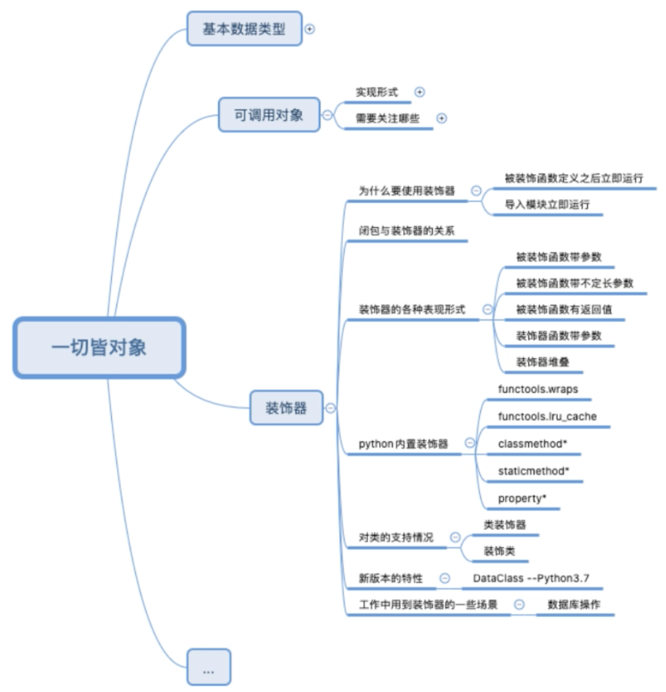

# 闭包和装饰器



## 为什么要使用装饰器

- 被装饰函数定义后立即运行
- 导入模块立即运行。如果不要装饰器自动运行，网上都代码。。。。。。。。。。

## 闭包与装饰器的关系

### 闭包

闭包是什么：延伸了作用域的函数

- 函数名.__code__.co_freevars：查看编译后的函数定义体，Enclosing作用域的变量（LEGB）
- 函数名.__closure__[0].cell_contents查看这些cell对象的cell_contents属性，即freevars对应的值

作用：调用函数时，仍然可以使用绑定的值（虽然作用域不可用

```python
def func1():
    pass
var = func1         # func1 表示函数
var2 = func1()      # func1() 表示执行函数

a = func1           # a 保存的是代码段的内存地址
b = func1()         # b 保存的是函数执行结果的内存地址


# 装饰器, @ 语法糖
@decorate
def func():
    print('do sth')

# 等效于下面
def func():
    print('do sth')
func = decorate(func)
```

### 装饰器

- PEP-318 装饰器
- PEP-3129 类装饰器

- 增强而不改变原有函数
- 装饰器强调函数的定义态而不是运行态

传入一个函数，在内部函数调用，返回内部函数

装饰器语法糖的展开：

```python
@decorate
def target():
    print('do something')

def target():
    print('do something')

target = decorate(target)
```

装饰器在模块导入时自动运行：

```python
# 编写模块文件testmodule.py
def decorate(func):
    print('running in module')
    def inner():
        return func()
    return inner

@decorate
def func():
    pass

# 测试文件test.py，导入模块，观察装饰器自动执行
import testmodule  # from testmodule import decorate
```

装饰器：衬衣套棉衣、游戏玩家等级提升增加属性、游戏装备

常用场景：

- 日志
- 访问控制和授权
- 附加限制，如限制访问函数频率
- 增加缓存

## 装饰器对函数的各种表现形式

flask示例，请求 index.html，限定只允许 GE 和 POST 方式请求，返回 index.html 页面，返回的时候增加一些前端渲染的代码：

```python
@route('index',methods=['GET','POST'])
def static_html():
    return  render_templete('index.html')

# 等效于
static_html = route('index',methods=['GET','POST'])(static_html)


def route(rule, **options):
    def decorator(f):
        endpoint = options.pop("endpoint", None)
        # 使用类似字典的结构以'index'为key 以 method static_html  其他参数为value存储绑定关系
        self.add_url_rule(rule, endpoint, f, **options)
        return f
    return decorator
```

包装：

```python
def html_header(func):
    def inner():
        return f'<html>{func()}</html>'
    return inner

def body_header(func):
    def inner():
        return f'<body>{func()}</body>'
    return inner

@html_header
@body_header
def content():
    return f'hello world'

content()
```

### 装饰带参数（定长参数）的函数

在内部函数携带参数。

```python
# 被修饰函数带参数
from time import ctime,sleep

def outer(func):
    def inner(a,b):
        print("%s called at %s"%(func.__name__,ctime()))
        print(a,b)
        func(a,b)
    return inner

@outer
def foo(a,b):
    print(a+b)
    print("%s called at %s"%(foo.__name__,ctime()))


foo(1,2)
sleep(2)
foo(3,4)
```

### 装饰带参数（不定长参数）的函数

在内部函数携带参数(*args, **kwargs)。

```python
# 被修饰函数带不定长参数
from time import ctime,sleep

def outer2(func):
    def inner2(*args, **kwargs):
        print("%s called at %s"%(func.__name__,ctime()))
        func(*args,**kwargs)
    return inner2

@outer2
def foo2(a,b,c):
    print(a+b+c)

foo2(1,3,5)     # 相当于 outer.inner(1, 3, 5)，即foo2(1,3,5)被替换成 inner(1,3,5)，inner里面的 func 才是原始的函数
sleep(2)
foo2(1,2,3)     # 相当于 outer.inner(1, 2, 3)，即foo2(1,2,3)被替换成 inner(1,2,3)，inner里面的 func 才是原始的函数
```

### 被装饰函数有返回值

如果被修饰的函数有返回值，一定要在内部函数里给一个返回值，因为原函数已被 inner 函数替换。

```python
from time import ctime,sleep

def outer2(func):
    def inner2(*args, **kwargs):
        print("%s called at %s"%(func.__name__,ctime()))
        ret = func(*args,**kwargs)          # 在内部函数给一个返回值
        return ret                          # 返回给 inner 函数
    return inner2

@outer2
def foo(a,b,c):
    print(a+b+c)

a = foo(1,3,5))                 # 如果没有在内部函数返回值，这里是得不到赋值的，因为已经被 inner 函数替换
```

### 装饰器带参数

在外面再套一层函数，用来传参：

```python
# 装饰器带参数
from time import ctime,sleep

def outer_arg(bar):
    def outer(func):
        def inner(*args,**kwargs):
            print("%s called at %s"%(func.__name__,ctime()))
            ret = func(*args,**kwargs)
            print(bar)
            return ret
        return inner
    return outer

# 相当于outer_arg('foo_arg')(foo)()
@outer_arg('foo_arg')
def foo(a,b,c):
    return (a+b+c)

print(foo(1,3,5))
```

### 装饰器堆叠

一般是系统内置的一些装饰器

```python
# 装饰器堆叠

@classmethod
@synchronized(lock)
def foo(cls):
    pass


def foo(cls):
    pass
foo = synchronized(lock)(foo)
foo = classmethod(foo)
```

## python 内置装饰器

### functools.wraps

函数被装饰后，函数名被替换成 inner，参数被替换成 inner(参数)，文档属性被替换成 inner，所以将无法返回原函数的一些属性，比如想获得原函数的名字foo.__name__，foo.__doc__将无法获取。

wraps 装饰器会将函数名字、函数参数列表、函数文档会被替换回原有参数的属性。

用 update_wrapper()替换，用偏函数 partial 固定属性，建议阅读这部分源码，很优雅。

```python
# functools.wraps
# @wraps接受一个函数来进行装饰
# 并加入了复制函数名称、注释文档、参数列表等等的功能
# 在装饰器里面可以访问在装饰之前的函数的属性
# @functools.wraps(wrapped, assigned=WRAPPER_ASSIGNMENTS, updated=WRAPPER_UPDATES)
# 用于在定义包装器函数时发起调用 update_wrapper() 作为函数装饰器。
# 它等价于 partial(update_wrapper, wrapped=wrapped, assigned=assigned, updated=updated)。

from time import ctime,sleep
from functools import wraps
def outer_arg(bar):
    def outer(func):
        # 结构不变增加wraps
        @wraps(func)
        def inner(*args,**kwargs):
            print("%s called at %s"%(func.__name__,ctime()))
            ret = func(*args,**kwargs)
            print(bar)
            return ret
        return inner
    return outer

@outer_arg('foo_arg')
def foo(a,b,c):
    return (a+b+c)

print(foo.__name__)
```

```python
# flask 使用@wraps()的案例
# 认证完成后还是原有的函数名称，不要被替换
from functools import wraps

def requires_auth(func):
    @wraps(func)
    def auth_method(*args, **kwargs):
        if not auth:
            authenticate()
        return func(*args, **kwargs)
    return auth_method

@requires_auth
def func_demo():
    pass
```

日志功能，

```python
from functools import wraps

def logit(logfile='out.log'):
    def logging_decorator(func):
        @wraps(func)
        def wrapped_function(*args, **kwargs):
            log_string = func.__name__ + " was called"
            print(log_string)
            with open(logfile, 'a') as opened_file:
                opened_file.write(log_string + '\n')
            return func(*args, **kwargs)
        return wrapped_function
    return logging_decorator

@logit()
def myfunc1():
    pass

myfunc1()
# Output: myfunc1 was called

@logit(logfile='func2.log')
def myfunc2():
    pass

myfunc2()
# Output: myfunc2 was called
```

```python
# 可以使用wrapt包替代@wraps
# # wrapt包 https://wrapt.readthedocs.io/en/latest/quick-start.html
#  @wrapt.decorator
#  def wrapper(func, instance, args, kwargs):

import wrapt

def with_arguments(myarg1, myarg2):
    @wrapt.decorator
    def wrapper(wrapped, instance, args, kwargs):
        return wrapped(*args, **kwargs)
    return wrapper

@with_arguments(1, 2)
def function():
    pass
```

### functools.lru_cache

```python
# functools.lru_cache
# 《fluent python》的例子
# functools.lru_cache(maxsize=128, typed=False)有两个可选参数
# maxsize代表缓存的内存占用值，超过这个值之后，就的结果就会被释放
# typed若为True，则会把不同的参数类型得到的结果分开保存
import functools
@functools.lru_cache()
def fibonacci(n):
    if n < 2:
        return n
    return fibonacci(n-2) + fibonacci(n-1)

if __name__=='__main__':
    import timeit
    print(timeit.timeit("fibonacci(6)", setup="from __main__ import fibonacci"))
```

### classmethod*

### staticmethod*

### property*

## 对类的支持情况

### 类中的函数的装饰器

Python 2.6 开始添加类装饰器

```python
from functools import wraps

class MyClass(object):
    def __init__(self, var='init_var', *args, **kwargs):
        self._v = var
        super(MyClass, self).__init__(*args, **kwargs)

    def __call__(self, func):
        # 类的函数装饰器
        @wraps(func)
        def wrapped_function(*args, **kwargs):
            func_name = func.__name__ + " was called"
            print(func_name)
            return func(*args, **kwargs)
        return wrapped_function
```

### 装饰类

装饰器中要定义与类中相同的函数（函数名相同）

```python
# 装饰类
def decorator(aClass):
    class newClass(object):
        def __init__(self, args):
            self.times = 0
            self.wrapped = aClass(args)
        def display(self):
            self.times += 1
            print("run times", self.times)
            self.wrapped.display()
    return newClass

@decorator
class MyClass(object):
    def __init__(self, number):
        self.number = number
    def display(self):
        print("number is",self.number)

six = MyClass(6)
for i in range(5):
    six.display()
```

## 工作中用到装饰器的一些场景

官方文档装饰器的其他用途举例

```python
# 向一个函数添加属性
def attrs(**kwds):
    def decorate(f):
        for k in kwds:
            setattr(f, k, kwds[k])  # setattr 函数给一个对象增加属性
        return f
    return decorate

@attrs(versionadded="2.2",
       author="Guido van Rossum")
def mymethod(f):
    pass
```

```python
# 函数及参数观察器
import functools
def trace(func):
    @functools.wraps(func)
    def inner(*args, **kwargs):
        print(func, args, kwargs)
        result = func(*args, **kwargs)
        print(f'result={result}')
    return inner

@trace
def greet(greeting, name):
    return f'{greeting}, {name}!'

greet('better', 'me')
#print(greet('better', 'me'))
```

```python
# 每个类会占用内存空间，静态字段、def 方法，每个对象也会占用内存空间
# 用单例实例定义一个类，比如游戏中所有玩家只看到一个太阳，而不是每个实例一个太阳
# 单实例还可以用__new__的方式创建

def singleton(cls):
    instances = {}
    def getinstance():
        if cls not in instances:
            instances[cls] = cls()
        return instances[cls]
    return getinstance

@singleton
class MyClass:
    pass
```

```python
# 写 API 用的多
# 限定函数参数和返回类型
# assert 2==1,'2不等于1' 断言语句为raise-if-not，
# 用来测试表示式，其返回值为假，就会触发异常

def accepts(*types):
    def check_accepts(f):
        assert len(types) == f.func_code.co_argcount
        def new_f(*args, **kwds):
            for (a, t) in zip(args, types):
                assert isinstance(a, t), \
                       "arg %r does not match %s" % (a,t)
            return f(*args, **kwds)
        new_f.func_name = f.func_name
        return new_f
    return check_accepts

def returns(rtype):
    def check_returns(f):
        def new_f(*args, **kwds):
            result = f(*args, **kwds)
            assert isinstance(result, rtype), \
                   "return value %r does not match %s" % (result,rtype)
            return result
        new_f.func_name = f.func_name
        return new_f
    return check_returns

@accepts(int, (int,float))
@returns((int,float))
def func(arg1, arg2):
    return arg1 * arg2
```

```python
# 如下的类装饰器实现了一个用于类实例属性的Private声明
# 属性存储在一个实例上，或者从其一个类继承而来
# 不接受从装饰的类的外部对这样的属性的获取和修改访问
# 但是，仍然允许类自身在其方法中自由地访问那些名称
# 类似于Java中的private属性

traceMe = False
def trace(*args):
    if traceMe:
        print('['+ ' '.join(map(str,args))+ ']')

def Private(*privates):
    def onDecorator(aClass):
        class onInstance:
            def __init__(self,*args,**kargs):
                self.wrapped = aClass(*args,**kargs)
            def __getattr__(self,attr):
                trace('get:',attr)
                if attr in privates:
                    raise TypeError('private attribute fetch:'+attr)
                else:
                    return getattr(self.wrapped,attr)
            def __setattr__(self,attr,value):
                trace('set:',attr,value)
                if attr == 'wrapped': # 这里捕捉对wrapped的赋值
                    self.__dict__[attr] = value
                elif attr in privates:
                    raise TypeError('private attribute change:'+attr)
                else: # 这里捕捉对wrapped.attr的赋值
                    setattr(self.wrapped,attr,value)
        return onInstance
    return onDecorator

if __name__ == '__main__':
    traceMe = True

    @Private('data','size')
    class Doubler:
        def __init__(self,label,start):
            self.label = label
            self.data = start
        def size(self):
            return len(self.data)
        def double(self):
            for i in range(self.size()):
                self.data[i] = self.data[i] * 2
        def display(self):
            print('%s => %s'%(self.label,self.data))

    X = Doubler('X is',[1,2,3])
    Y = Doubler('Y is',[-10,-20,-30])
    print(X.label)
    X.display()
    X.double()
    X.display()
    print(Y.label)
    Y.display()
    Y.double()
    Y.label = 'Spam'
    Y.display()

    # 这些访问都会引发异常
    # print(X.size())
    # print(X.data)
    # X.data = [1,1,1]
    # X.size = lambda S:0
    # print(Y.data)
    # print(Y.size())

# 这个示例运用了装饰器参数等语法，稍微有些复杂，运行结果如下：
# [set: wrapped <__main__.Doubler object at 0x03421F10>]
# [set: wrapped <__main__.Doubler object at 0x031B7470>]
# [get: label]
# X is
# [get: display]
# X is => [1, 2, 3]
# [get: double]
# [get: display]
# X is => [2, 4, 6]
# [get: label]
# Y is
# [get: display]
# Y is => [-10, -20, -30]
# [get: double]
# [set: label Spam]
# [get: display]
```

## 新版本的特性

### @dataclass

Python3.7 引入 Data Class  PEP557

```python
from dataclasses import dataclass
class MyClass:
    def __init__(self, var_a, var_b):
        self.var_a = var_a
        self.var_b = var_b

var3 = MyClass('x', 'y')
var4 = MyClass('x', 'y')

>>> var3 == var4
False
```

```python
# 判断值是否相等
from dataclasses import dataclass
class MyClass:
    def __init__(self, var_a, var_b):
        self.var_a = var_a
        self.var_b = var_b
    def __eq__(self, other):                            # 魔术方法判断值是否相等
        if self.__class__ is not other.__class__:
            return False
        return (self.var_a, self.var_b) == (other.var_a, other.var_b)

var3 = MyClass('x', 'y')
var4 = MyClass('x', 'y')

>>> var3 == var4
True
```

```python
# 使用 dataclass 判断值是否相等，不用在类中重新封装__eq__
from dataclasses import dataclass
cfrom dataclasses import dataclass

@dataclass
class MyClass:
    var_a: str
    var_b: str

var1 = MyClass('x', 'y')
var2 = MyClass('x', 'y')

var1 == var2

>>> var1 == var2
True
```

注意：**存在问题**

- var_a, var_b 不能作为类属性访问
- 数据类型 str 的声明是无效的

类装饰器还能支持

- @classmethod
- @staticmethod
- @property
- @*.setter
- @*.deleter
