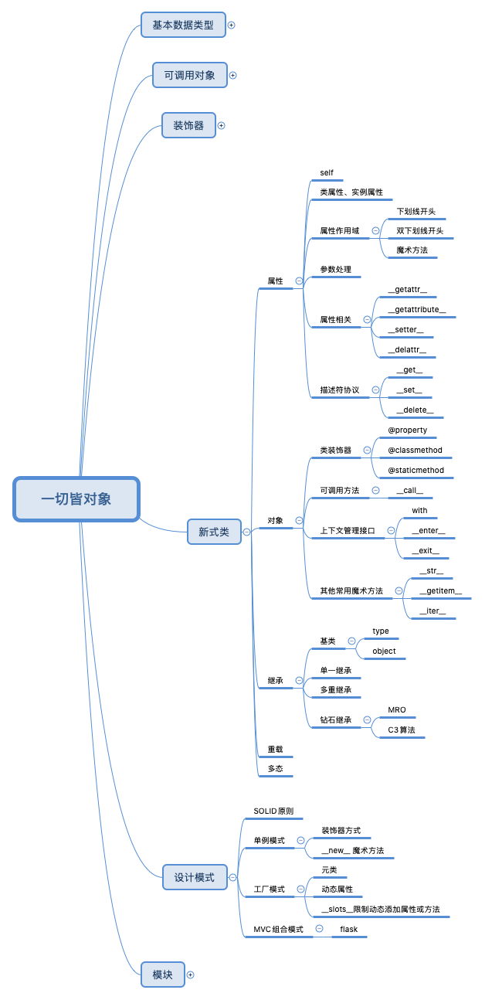
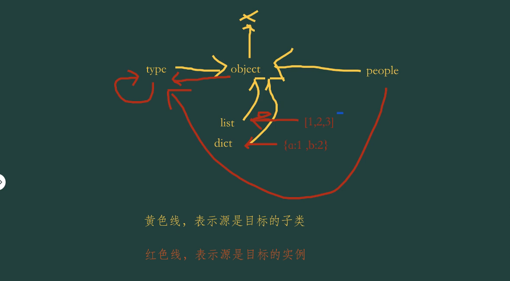
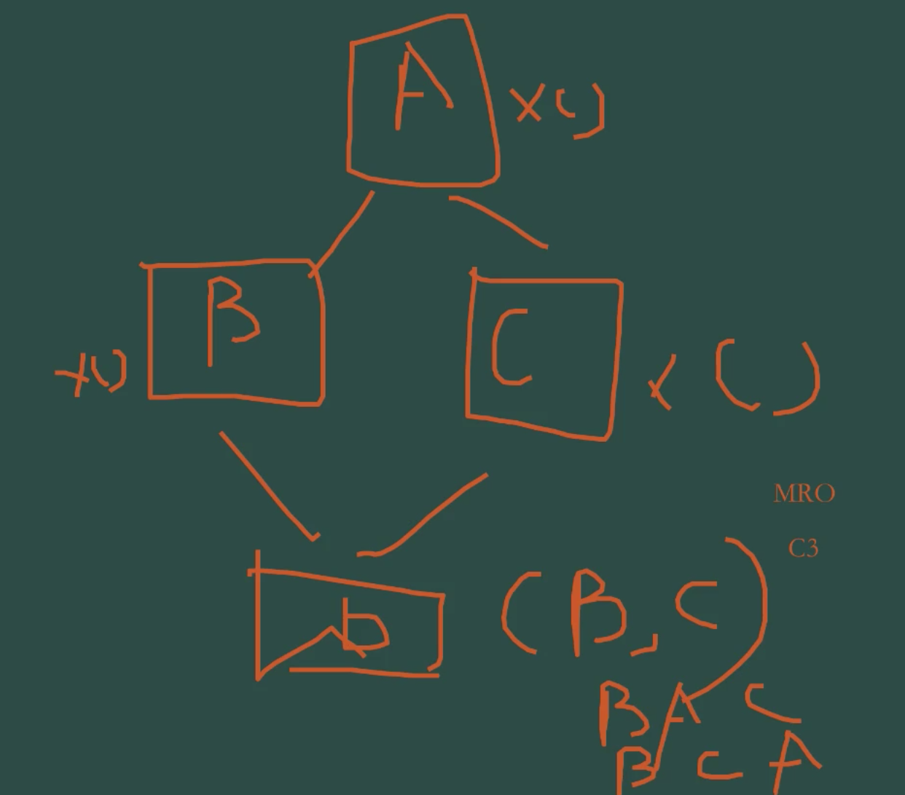
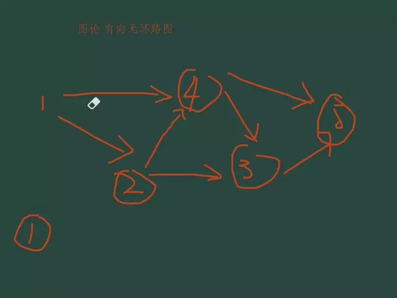

# 面向对象与设计模式



## 学习目标

- 掌握面向对象编程、单例模式、工厂模式
- 掌握元类、C3算法、MRO、魔术方法
- 掌握元编程与工厂函数
- 了解异常处理机制的原理和用法

## 面向对象编程：新式类

- 现实世界的对象和Python世界的对象
- 对象是一个数据以及相关行为的集合
- Python的经典类与新式类
- 类的两大成员：属性和方法

### 定义

- 对象：数据和相关行为的集合
- 类：描述对象

- 经典类：不全是对象
- 新式类：python2.2 以后引入，在 2.7 成熟，3 完全新式类一切都是对象

python2 中区分经典类、新式类的方法：

- class MyFirstClass: 经典类
- class MyFirstClass(object): 新式类

python3 中：带不带 object 都是新式类

```python
# I have a dream
class MyFirstClass:
    pass
a = MyFirstClass()
b = MyFirstClass()

# 不同内存地址，两个不同对象
type(a)
id(a)
a.__class__()       # 对象地址
b.__class__()       # 对象地址，与 a 对象地址不同

# 类也是对象
c = MyFirstClass    # 把类进行赋值，()是执行类
d = c()
d.__class__()
```

### 属性

- 类属性与对象属性
- 类属性字段在内存中只保存一份
- 对象属性在每个对象都保存一份

```python
# 女娲
class Human(object):
    # 静态字段，即俗称类的属性
    live = True

    def __init__(self, name):         # 只有一个功能：接收类传入的参数，self 不是关键字可改变
        # 普通字段，即俗称实例的属性
        self.name = name

man = Human('Adam')
woman = Human('Eve')


Human.__dict__          # 列出类型的属性，查看是否有 live 属性。如判断属性是否存在
man.__dict__            # 列出实例的属性，查看是否有name属性

# 实例可以使用普通字段也可以使用静态字段
man.name    # 查看实例的的 name属性
man.live    # 查看实例的 live 属性，live 是类属性

# 类可以使用类属性
Human.live

# 实例可以修改类属性吗
man.live = False
man.live           # False，查看man.__dict__，发现实例有 live 属性，实际上是给实例添加了live 属性，并不能修改类属性
woman.live         # 仍然是 True，查看 woman.__dict__，发现没有 live 属性

# 内置类型不能用 setattr 添加属性和方法，自定义类型可以
setattr(list, 'newattr', 'value')   # TypeError
```

属性命名：

- 单下划线（_属性名）：人为约定不可修改，实际可改
- 双下划线（__属性名）：
  - 私有属性，实例化是不能被调用的
  - class名.__dict__查看其变化后的名字，不建议去修改
  - 魔术方法不会自动改名，如写错了，与现有方法同名，是不会自动改名的，如__init__
- 属性名_（后下划线）：和保留字冲突，如 object、object_

```python
class Human2(object):
    # 人为约定不可修改
    _age = 0

    # 私有属性
    __fly = False

    # 魔术方法，不会自动改名
    # 如 __init__

# 自动改名机制
Human2.__dict__     # 查看改名
```

子类访问父类的普通私有属性：

```python
class Person(object):
    def __init__(self):
        self.__name = 'tom'         # 普通属性，私有


class VIP(Person):
    def __init__(self):
        super().__init__()
    def gett(self):
        print(self.__dict__)
        print(self._Person__name)       # 访问父类的普通私有属性

a = VIP()
print(a.gett())
# print(a.__dict__)
```

### 属性、方法常用操作

```python
class Human(object):

    # 使用__init__接收参数，思考不定参数处理
    def __init__(self, name):
        # self表示对象本身，约定俗成
        self.name = name

h1 = Human('Adam')
h2 = Human('Eve')


# 对实例属性做修改
h1.name = 'python'
# 对实例属性查询
h1.name
h2.name

# 删除实例属性
del h1.name
h1.name     # 访问不存在的属性，AtrributeError
```

最常用操作：取属性的值，设置属性的值，把他拦截下来，进行特殊处理，进行截获的 4 个方法：

- `__getattr__`
- `__getattribute__`
- `__get__`
- `@property`

#### __getattr__()、__getattribute__()、__get__()

截获对属性值读取操作，改变其默认行为。

如果同时存在，执行顺序是 __getattribute__ > __getattr__ > __dict__

getattribute__ 返回存在的属性，如果不存在抛出  AttributeError 异常，继续访问__getattr__函数

getattr__ 拦截任意属性

```python
###############################
# 观察添加实例属性的默认行为
class Human2(object):
    def __init__(self):
        self.age = 18

h1 = Human2()

>>> h1.age      # 实例属性存在，返回其值
18
>>> h1.name     # 实例属性不存在，报错
Traceback (most recent call last):
  File "<stdin>", line 1, in <module>
AttributeError: 'Human2' object has no attribute 'name'

>>> h1.name = 'jim'     # 添加实例属性和值
>>> h1.__dict__         # 实例中属性被添加
{'age': 18, 'name': 'jim'}
>>>


###############################
# 观察 __getattr__()
# 其对不存在的属性进行拦截，改变其默认行为
class Human2(object):
    def __init__(self):
        self.age = 18
    def __getattr__(self, item):    # item：属性名
        print('Human2:__getattr__')
        return 'tom'                # 为不存在的属性设置了默认值

h1 = Human2()

>>> h1.age              # 实例属性存在，没有被拦截
18

>>> h1.name             # 实例属性不存在
Human2:__getattr__      # 先返回 Human2:__getattr__，说明被拦截
'tom'                   # 再返回 'tom'，给不存在的属性设置了默认值

>>> h1.__dict__         # 实例属性仍然没有 name属性，除非在__getattr__进行处理
{'age': 18}

>>> h1.name = 'jim'     # name 属性不存在，为实例增加属性
>>> h1.__dict__         # 实例属性被增加
{'age': 18, 'name': 'jim'}


################################
# 观察 __getattribute__()
# 其拦截任意属性，存在的属性、不存在的属性都被拦截
class Human2(object):
    def __init__(self):
        self.age = 18
    def __getattribute__(self,item):
        print('Human2:__getattribute__')
        return super().__getattribute__(item)   # 存在的属性，返回其原值

        # 这里会返回RecursionError: maximum recursion depth
        #  exceeded while calling a Python object
        # return self.__getattribute__(item)  # 如果是这样会返回循环错误

h1 = Human2()

>>> h1.age                  # 实例属性存在
Human2:__getattribute__     # 被拦截
18                          # 返回其原值

>>> h1.name                 # 实例属性不存在
Human2:__getattribute__     # 被拦截
Traceback (most recent call last):
  File "<stdin>", line 1, in <module>
  File "<stdin>", line 10, in __getattribute__
AttributeError: 'Human2' object has no attribute 'name'     # 抛出错误不存在

>>> h1.__dict__
Human2:__getattribute__
{'age': 18}
>>>

>>> h1.name = 'tom'         # 添加不存在的属性
>>> h1.name
Human2:__getattribute__     # 被拦截到
'tom'
>>> h1.__dict__             # 属性被增加
Human2:__getattribute__
{'age': 18, 'name': 'tom'}
>>>
```

对不存在的实例属性进行处理：

```python
class Human2(object):
    def __getattribute__(self, item):
        """
        将不存在的属性设置为100并返回,模拟 __getattr__() 的行为
        """
        print('Human2:__getattribute__')
        try:
            return super().__getattribute__(item)
        except Exception as e:
            self.__dict__[item] = 100
            return 100
h1 = Human2()

>>> h1.noattr
Human2:__getattribute__
Human2:__getattribute__
100                         # 默认值被设置，并增加属性

>>> h1.__dict__             # 增加了属性
Human2:__getattribute__
{'age': 100, 'name': 100, 'noattr': 100}
>>>
```

使用 __getattr__() 对不存在的属性进行处理：

```python
class Human2(object):
    def __init__(self):
        self.age = 18

    def __getattr__(self, item):
        """
        不存在的属性返回'OK'
        """
        print('Human2:__getattr__')
        return 'OK'         # 为不存在的属性设置了默认值

h1 = Human2()

>>> h1 = Human2()
>>> h1.age                  # 已存在的实例属性
18                          # 没有被拦截，返回属性值

>>> h1.noattr               # 获取不存在的实例属性的值
Human2:__getattr__          # 被拦截
'OK'                        # 返回默认值

>>> h1.__dict__             # 注意，实例没有增加属性，与__getattribute__()不同
{'age': 18}
>>>
```

使用 __getattr__() 对不存在的属性进行处理：

```python
class Human2(object):
    def __init__(self):
        self.age = 18

    def __getattr__(self, item):
        """
        fly属性返回'superman',其他属性返回None
        """
        print('Human2:__getattr__')
        self.item = item
        if self.item == 'fly':
            return 'superman'
        # return 'OK'


h1 = Human2()

print(h1.age)
print(h1.fly)
print(h1.noattr)
```

__getattribute__()、__getattr__() 同时存在：

```python
class Human2(object):
    """
    所有的属性都能得到返回
    """
    def __init__(self):
        self.age = 18

    def __getattr__(self, item):

        print('Human2:__getattr__')
        return 'Err 404 ,你请求的参数不存在'

    def __getattribute__(self, item):
        print('Human2:__getattribute__')
        return super().__getattribute__(item)

h1 = Human2()

# __getattribute__ 返回存在的属性，如果不存在抛出  AttributeError 异常，继续访问__getattr__函数
# 如果同时存在，执行顺序是 __getattribute__ > __getattr__ > __dict__
print(h1.age)
print(h1.noattr)
# 注意输出，noattr的调用顺序
```

- `__getattribute__`：拦截任何属性，先调用__getattribute__，再调用__getattr__
- `__getattribute__`：无论属性存不存在，都会执行，如果存在返回值，如果不存在抛出异常(或用__getattr__处理)：
- 获取属性两种拦截方法：__getattribure__()  __getattr__()，不管存不存在都会经过 __getattribure__()，如果存在则返回属性值，如果不存在报 AttribError，再引入 __getattr__() 进行处理，方法是把属性添加到 __dict__ 中
- 通常用 getattr 告诉对方你用错了属性

__getatrribute__()这个是python的c源码里的。里面定义了整个完整的获取attribuet的过程，其中可能还会涉及mro，data descriptor这些。
但正常的过程就是，1从对象本身获取attr，2从class获取attr，3调用__getattr__()

<https://stackoverflow.com/questions/4295678/understanding-the-difference-between-getattr-and-getattribute>

__getattribute__() 的底层原理是描述器(黑魔法)：

```python
# __getattribute__ 的底层原理是描述器
# 这里描述器与内置唯一不同的就是多了 print，方便观察
class Desc(object):
    """
    通过打印来展示描述器的访问流程
    """
    def __init__(self, name):
        self.name= name

    def __get__(self, instance, owner):
        print(f'__get__{instance} { owner}')
        return self.name

    def __set__(self, instance, value):
        print(f'__set__{instance} {value}')
        self.name = value

    def __delete__(self, instance):
        print(f'__delete__{instance}')
        del self.name

class MyObj(object):
    a = Desc('aaa')
    b = Desc('bbb')

if __name__ == '__main__':
    inst = MyObj()
    print(inst.a)
    inst.a = 456
    print(inst.a)
```

__getattribute__() 的纯python实现：

```python
# __getattribute__ 纯python实现
def __getattribute__(self, key):
    "Emulate type_getattro() in Objects/typeobject.c"   # 是用 c 写的，性能高
    v = object.__getattribute__(self, key)
    if hasattr(v, '__get__'):
      return v.__get__(None, self)
    return v
```

__getattribute__()只有一个，__getattr__()有一组，包括__setattr__()，__delsttr__()，分别在设置属性、删除属性时进行拦截。

尽量用__getattr__()，性能高，一般用来返回你取错了。

#### @property

作用是将方法封装成属性，属性使用更简单，不用考虑参数什么的，风格更统一

比如获取云主机的信息：

```python
a = Cloud()
a.id
a.ip
a.is_alive()       # 这样就会不优雅，方法和其它属性写法混杂，在这种情况下把方法转化为属性
a.is_alive         # 前后一致，优雅
```

```python
class Human(object):
    def __init__(self, name):
        self.name = name

    # 将方法封装成属性
    @property
    def gender(self):
        return 'M'

h1 = Human('Adam')
h2 = Human('Eve')
h1.gender           # 把方法当属性来使用

# AttributeError:
h2.gender = 'F'
```

@property 也支持设置和删除：

```python
# 女娲
class Human2(object):
    def __init__(self):
        self._gender = None
    # 将方法封装成属性
    @property               # 只完成 get
    def gender(self):
        print(self._gender)

    # 支持修改
    @gender.setter              # 建议方法名与装饰器名一致，可以不同，如 def gender2，@gender3.setter
    def gender(self,value):
        self._gender = value

    # 支持删除
    @gender.deleter
    def gender(self):
        del self._gender


h = Human2()
h.gender = 'F'
h.gender
```

另一种property写法

```python
gender  = property(get_, set_, del_, 'other property')
```

不使用setter 并不能真正意义上实现无法写入，gender被改名为 _Article__gender

property 纯python实现：

```python
# property 纯python实现

class Property(object):
    "Emulate PyProperty_Type() in Objects/descrobject.c"
    def __init__(self, fget=None, fset=None, fdel=None, doc=None):
        self.fget = fget
        self.fset = fset
        self.fdel = fdel
        if doc is None and fget is not None:
            doc = fget.__doc__
            self.__doc__ = doc

    def __get__(self, obj, objtype=None):
        if obj is None:
            return self
        if self.fget is None:
            raise AttributeError("unreadable attribute")
        return self.fget(obj)

    def __set__(self, obj, value):
        if self.fset is None:
            raise AttributeError("can't set attribute")
        self.fset(obj, value)

    def __delete__(self, obj):
        if self.fdel is None:
            raise AttributeError("can't delete attribute")
        self.fdel(obj)

    def getter(self, fget):
        return type(self)(fget, self.fset, self.fdel, self.__doc__)

    def setter(self, fset):
        return type(self)(self.fget, fset, self.fdel, self.__doc__)

    def deleter(self, fdel):
        return type(self)(self.fget, self.fset, fdel, self.__doc__)
```

#### @classmethod

把**实例的方法**变成类的方法。

```python
a = Cloud()
a.get_name()        # 实例的方法调用：要先实例化，再调用

Cloud.get_name()    # 类的方法调用
```

```python
class A(object):
    bar = 1
    def foo(self):
        print('in foo')

    @classmethod            # 使用类属性、方法
    def class_foo(cls):     # 不是 self 指实例，这里 cls 代表当前类
        print(cls.bar)      # 因此可以访问类的属性
        cls().foo()         # 也可以访问类的方法

A.class_foo()       # 类的方法调用

a = A()
a.class_foo()       # 同时也可以用实例的方法调用
```

```python
class Story(object):
    snake = 'Python'
    def __init__(self, name):
        self.name = name
    # 类的方法
    @classmethod
    def get_apple_to_eve(cls):
        return cls.snake

if __name__ == '__main__':
    s = Story('anyone')
    # get_apple_to_eve 是bound方法，查找顺序是先找s的__dict__是否有get_apple_to_eve,如果没有，查类Story
    print(s.get_apple_to_eve)
    # 类和实例都可以使用
    print(s.get_apple_to_eve())         # 实例可以调用
    print(Story.get_apple_to_eve())     # 类也可以调用
    print(type(s).__dict__['get_apple_to_eve'].__get__(s,type(s)))
    print(type(s).__dict__['get_apple_to_eve'].__get__(s,type(s)) == s.get_apple_to_eve)
```

#### @staticmethod

方法和类有关系，但是又没有相关属性引用；写成函数放到类外也可以，但是因为是统一类型的，因此放在类中。

- 静态方法可以由类直接调用
- 因为不传入self 也不传入 cls ，所以不能使用类属性和实例属性

```python
import datetime
class Story(object):
    snake = 'Python'
    def __init__(self, name):
        self.name = name
    # 静态的方法
    @staticmethod
    def god_come_go():          # 注意不能有 self，也不能有 cls
        if datetime.datetime.now().month % 2 :
             print('god is coming')

Story.god_come_go()
```

#### 其它装饰器（工作中常用）

Flask 中的一个底层实现，第一次放入缓存，后续只从缓存中读取：

```python
#1 实现缓存功能

from werkzeug.utils import cached_property

# werkzeug.utils.py p53，源码在该文件 53 行

class Foo(object):
    @cached_property
    def cal(self):
        print('show me one time')   # 第一次调用会打印，后续只会从缓存中读取不会打印
        var1 = 'cached info'
        return var1


bar = Foo()

>>> bar.cal             # 第一次调用
show me one time        # 第一次调用打印
'cached info'
>>> bar.cal             # 第二次调用，不会 print
'cached info'
>>>
```

跨公有云节点的判断，云主机取心跳，要判断时间，要判断是不是维修期等很多条件，但是只想给使用的人暴漏一个属性，该主机是否存活：

```python
######################
#ORM(flask.ext.sqlalchemy)
# 一个表记录一个节点的心跳更新
# 通过一个属性来获取节点是否可用，而不用写复杂的查询语句
class Node(db.Model):
    id = db.Column(db.Integer, primary_key=True)
    updated_at = db.Column(db.DateTime)           # 节点最后心跳时间
    state = db.Column(db.Integer, nullable=False) # 节点是否禁用

    @property
    def is_active(self):
        if(datetime.datetime.now() - self.updated_at).secondes > 60 \
            and self.vm_state == 0:
            return False
        return True
```

判断传入的类型和范围：

```python
#########################
# 限制传入的类型和范围（整数，且满足18-65）
class Age(object):
    def __init__(self, default_age = 18):
        self.age_range = range(18,66)
        self.default_age = default_age
        self.data = {}

    def __get__(self, instance, owner):
        return self.data.get(instance, self.default_age)

    def __set__(self, isinstance, value):
        if value not in self.age_range:
            raise ValueError('must be in (18-65)')

        self.data[isinstance] = value

class Student(object):
    age = Age()

if __name__ == '__main__':
    s1 = Student()
    s1.age = 30
    s1.age = 100
```

某云 api，参数非常多，对公司来讲ak、sk、region是相对固定的：

```python
############################
# 固定部分传递的参数
def xxyun_client(apitype, ak, sk, region='cn-beijing-3'):
    s = get_session()
    client = s.create_client(
        apitype,
        region,
        user_ssl = True,
        access_key =ak,
        secret_access_key =sk
    )
    return client


class XXYunBase(object):
    def __init__(self, account):
        self.account = account
        self.ak = self.account.ak
        self.sk = self.account.sk

    @property
    def eip_(self):
        return partial(xxyun_client, 'eip', self.ak, self.sk)   # 使用偏函数

    @property
    def vpc_(self):
        return partial(xxyun_client, 'vpc', self.ak, self.sk)   # 使用偏函数
```

获取状态，将状态的数字转化成文字输出：

```python
##################
@property
def current_state(self):
    instance_state = {
       1: '运行',
       2: '离线',
       3: '下线',

   }
    if(time_diff.seconds) >= 300:
       return instance_state[2]

    if self.state in range(10):
        return instance_state.get(self.state, '其他')
    return None

cloud.vpc0001.current_state     # 得到主机的状态
```

### 封装

把类封装成对象。

### 继承

子类继承父类，括号里写父类的名称

#### 问题1 gene有没有被继承

```python
# 父类
class People(object):
    def __init__(self):
        self.gene = 'XY'
    def walk(self):
        print('I can walk')

# 子类
class Man(People):
    def __init__(self,name):
        self.name = name
    def work(self):
        print('work hard')

class Woman(People):
    def __init__(self,name):
        self.name = name
    def shopping(self):
        print('buy buy buy')

p1 = Man('Adam')
p2 = Woman('Eve')

# 问题1 gene有没有被继承？
>>> p1.gene
Traceback (most recent call last):
  File "<stdin>", line 1, in <module>
AttributeError: 'Man' object has no attribute 'gene'
# 其实继承到了，但是由于子类也有__init__()，重写了父类的__init__()，所以没有继承到
```

使用 `super().__init__(name)` 继承父类的实例属性：

```python
# 父类
class People(object):
    def __init__(self, name):
        self.gene = 'XY'
        # 假设人人都有名字
        self.name = name
    def walk(self):
        print('I can walk')

# 子类
class Man(People):
    def __init__(self,name):
        # 找到Man的父类People，把类People的对象转换为类Man的对象
        super().__init__(name)  # super(Man, self).__init__(name)

    def work(self):
        print('work hard')

class Woman(People):
    def __init__(self,name):
        super().__init__(name)
    def shopping(self):
        print('buy buy buy')

p1 = Man('Adam')
p2 = Woman('Eve')

# 问题1 gene有没有被继承？
# super(Man,self).__init__()
```

#### 问题2 People的父类是谁

```python
>>> print('object', object.__class__, object.__bases__)
object <class 'type'> ()
>>> print('type', type.__class__, type.__bases__)
type <class 'type'> (<class 'object'>,)
```

object 与 type：

- type元类 由 type 自身创建，object类 由 元类type 创建
- type元类 继承了 object类
- type元类 可以修改内置类的功能



#### 问题3 能否实现多重层级继承

#### 问题4 能否实现多个父类同时继承

```python
class Son(Man, Woman):  # 继承 Man 和 Woman 父类
    pass
```

继承多个父类带来新的问题： 继承顺序

钻石继承即菱形继承，如下图所示：

都有相同的方法 x()，那么执行的顺序就有 BAC、或 BCA 两种

MRO（方法解析顺序），古典类和新式类方法不同，使用 C3 算法



用 Subclass.mro() 可以打印出继承的顺序。

使用图论，有向无环路图 分析 C3 算法的继承顺序，如下图所示：

先找入库为 0 的作为顶点，每次擦去入度为0 ，入度都为0取左边



```python
# 钻石继承
class BaseClass(object):
    num_base_calls = 0
    def call_me(self):
        print ("Calling method on Base Class")
        self.num_base_calls += 1

class LeftSubclass(BaseClass):
    num_left_calls = 0
    def call_me(self):
        print ("Calling method on Left Subclass")
        self.num_left_calls += 1

class RightSubclass(object):
    num_right_calls = 0
    def call_me(self):
        print("Calling method on Right Subclass")
        self.num_right_calls += 1

class Subclass(LeftSubclass,RightSubclass):
    pass

Subclass.mro()
# 广度优先， 另外Python3 中不加(object)也是新式类，但是为了代码不会误运行在python2下产生意外结果，仍然建议增加
# >>> Subclass.mro()
# [<class '__main__.Subclass'>, <class '__main__.LeftSubclass'>, <class '__main__.RightSubclass'>, <class '__main__.BaseClass'>, <class 'object'>]

#  修改RightSubclass 的 父类为 Object
>>> Subclass.mro()
# [<class '__main__.Subclass'>, <class '__main__.LeftSubclass'>, <class '__main__.BaseClass'>, <class '__main__.RightSubclass'>, <class 'object'>]

```

### 重载

- 参数类型不同重载，python 语法不支持，利用对象去重载，鸭子类型
- 参数个数不同重载

```python
class  Klass(object):
    def A(self):
        pass
    def A(self,a, b):
        print(f'{a},{b}')


inst = Klass()
# 没有实现重载
inst.A()
```

### 多态

也不支持，使用鸭子类型

## 设计模式

### 单例模式

### 简单的工厂模式

```python
class Human(object):
    def __init__(self):
        self.name = None
        self.gender = None

    def getName(self):
        return self.name

    def getGender(self):
        return self.gender

class Man(Human):
    def __init__(self, name):
        print(f'Hi,man {name}')

class Woman(Human):
    def __init__(self, name):
        print(f'Hi,woman {name}')

class Factory:
    def getPerson(self, name, gender):
        if gender == 'M':
            return Man(name)
        elif gender == 'F':
            return Woman(name)
        else:
            pass

if __name__ == '__main__':
    factory = Factory()
    person = factory.getPerson("Adam", "M")
```

提供不同形状的按钮，来自于一个基类都能按，继承下来实现不同的外观

## 模块
