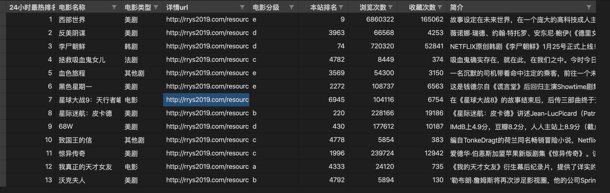
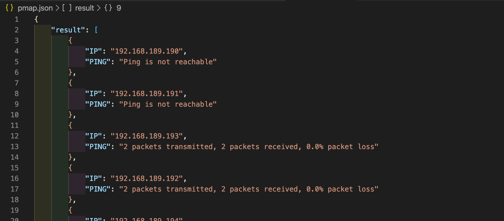

# 学习笔记

## 作业 1

结果如下图所示：



按老师所教套用框架没什么问题，时间主要花在对页面的分析、数据处理上，可见基本功才是最重要的。

问题 1：Selector 读不到内容，无法用 xpath 解析，解决办法：

浏览次数为异步加载，用浏览器开发工具的 network 观察页面访问请求，下面 2 个 movie 或 tv 都可以获取数据，movie 和 tv 应该是按类型分的，但实际测试无论什么类型，用任何一个都可以取到数据

- `http://www.rrys2019.com/resource/index_json/rid/38949/channel/movie`
- `http://www.rrys2019.com/resource/index_json/rid/33701/channel/tv`

问题 2：上面接口返回的数据是 'var index_info={...}'，如何获取浏览次数：

```python
# 将返回内容的'var index_info='字符串去掉，剩下的部分转换成 json 对象，方便提取数据：
movieViews = json.loads(response.text.strip('var index_info='))

# 就可以像字典一样获取数据：
movieViews = movieViews['views']
```

问题 3：取简介时，展开全文后，如果有换行，会有 `<br>` 标签，只能取到 `<br>` 前面的内容，取不到 `<br>` 后面的内容：

内容如下图所示：

```html
<div class="con">　故事设定在未来世界，在一个庞大的高科技成人主题乐园中，有着拟真人的机器“接待员”能让游客享尽情欲、暴力等欲望的放纵，主要叙述被称为“西部世界”的未来主题公园。它提供给游客杀戮与性欲的满足。
    <br>
　　但是在这世界下，各种暗流涌动。部分机器人出现自我觉醒，发现了自己只是作为故事角色的存在，并且想摆脱乐园对其的控制；乐园的管理层害怕乐园的创造者控制着乐园的一切而试图夺其控制权，而乐园创造者则不会善罢甘休并且探寻其伙伴创造者曾经留下的谜团；而买下乐园的一名高管试图重新发现当年的旅程留下的谜团。
</div>
```

平常用的 `text()`，只能取第一部分，类似text[0]，要获取全部内容，用 `string(.)`

```python
# 获取到上面那段
movieCon = Selector(response=response).xpath('//div[@class="con"][2]')
# 取到<div></div>之间的所有内容，再把 `\r\n` 清除掉
movieCon = movieCon.xpath('string(.)').extract_first().strip().replace('\r\n', '')
# 把字符中的空格都去掉
movieCon = ''.join(movieCon.split())
```

问题 4：`ValueError: I/O operation on closed file.` 错误：

文件关闭不能在 process_item() 中，应放在 close_spider() 中：

```python
def close_spider(self, spider):
        print('关闭.................')
        self.csvfile.close()
```

## 作业 2

ping：

```sh
$ python week03_0137_pmap.py -n 2 -f ping  -i 192.168.189.190
['192.168.189.190']
main: 15090
PPID: 15090, PID: 15091 | 192.168.189.190 | Ping is not reachable


$ python week03_0137_pmap.py -n 4 -f ping  -i 192.168.189.190-192.168.189.200
['192.168.189.190', '192.168.189.191', '192.168.189.192', '192.168.189.193', '192.168.189.194', '192.168.189.195', '192.168.189.196', '192.168.189.197', '192.168.189.198', '192.168.189.199', '192.168.189.200']
main: 15117
PPID: 15117, PID: 15120 | 192.168.189.192 | 2 packets transmitted, 2 packets received, 0.0% packet loss
PPID: 15117, PID: 15121 | 192.168.189.193 | 2 packets transmitted, 2 packets received, 0.0% packet loss
PPID: 15117, PID: 15118 | 192.168.189.190 | Ping is not reachable
PPID: 15117, PID: 15119 | 192.168.189.191 | Ping is not reachable
PPID: 15117, PID: 15120 | 192.168.189.194 | 2 packets transmitted, 2 packets received, 0.0% packet loss
PPID: 15117, PID: 15121 | 192.168.189.195 | Ping is not reachable
PPID: 15117, PID: 15118 | 192.168.189.196 | Ping is not reachable
PPID: 15117, PID: 15119 | 192.168.189.197 | 2 packets transmitted, 1 packets received, 50.0% packet loss
PPID: 15117, PID: 15120 | 192.168.189.198 | Ping is not reachable
PPID: 15117, PID: 15121 | 192.168.189.199 | Ping is not reachable
PPID: 15117, PID: 15118 | 192.168.189.200 | Ping is not reachable
```

端口扫描：

```sh
$ python week03_0137_pmap.py -n 2 -f tcp  -i 192.168.189.190
main: 13031
PPID: 13031, PID: 13032 | 192.168.189.190 | {53000: 'OPEN'}
PPID: 13031, PID: 13035 | 192.168.189.190 | {53003: 'CLOSE'}
PPID: 13031, PID: 13034 | 192.168.189.190 | {53002: 'CLOSE'}
PPID: 13031, PID: 13033 | 192.168.189.190 | {53001: 'CLOSE'}
PPID: 13031, PID: 13032 | 192.168.189.190 | {53004: 'CLOSE'}
PPID: 13031, PID: 13033 | 192.168.189.190 | {53005: 'CLOSE'}
PPID: 13031, PID: 13032 | 192.168.189.190 | {53008: 'CLOSE'}
PPID: 13031, PID: 13035 | 192.168.189.190 | {53007: 'CLOSE'}
PPID: 13031, PID: 13034 | 192.168.189.190 | {53006: 'CLOSE'}
PPID: 13031, PID: 13032 | 192.168.189.190 | {53009: 'CLOSE'}
```

```sh
$ python pmap.py -n 2 -f tcp  -i 192.168.189.190-192.168.189.1.191
main: 12870
PPID: 12870, PID: 12871 | 192.168.189.190 | {53000: 'OPEN'}
PPID: 12870, PID: 12873 | 192.168.189.190 | {53002: 'CLOSE'}
PPID: 12870, PID: 12872 | 192.168.189.190 | {53001: 'CLOSE'}
PPID: 12870, PID: 12874 | 192.168.189.190 | {53003: 'CLOSE'}
PPID: 12870, PID: 12871 | 192.168.189.190 | {53004: 'CLOSE'}
PPID: 12870, PID: 12874 | 192.168.189.190 | {53007: 'CLOSE'}
PPID: 12870, PID: 12872 | 192.168.189.190 | {53006: 'CLOSE'}
PPID: 12870, PID: 12873 | 192.168.189.190 | {53005: 'CLOSE'}
PPID: 12870, PID: 12871 | 192.168.189.190 | {53008: 'CLOSE'}
PPID: 12870, PID: 12872 | 192.168.189.190 | {53009: 'CLOSE'}
PPID: 12870, PID: 12883 | 192.168.189.191 | {53000: 'CLOSE'}
PPID: 12870, PID: 12885 | 192.168.189.191 | {53002: 'CLOSE'}
PPID: 12870, PID: 12884 | 192.168.189.191 | {53001: 'CLOSE'}
PPID: 12870, PID: 12886 | 192.168.189.191 | {53003: 'CLOSE'}
PPID: 12870, PID: 12884 | 192.168.189.191 | {53006: 'CLOSE'}
PPID: 12870, PID: 12885 | 192.168.189.191 | {53004: 'CLOSE'}
PPID: 12870, PID: 12883 | 192.168.189.191 | {53005: 'CLOSE'}
PPID: 12870, PID: 12886 | 192.168.189.191 | {53007: 'CLOSE'}
PPID: 12870, PID: 12884 | 192.168.189.191 | {53008: 'CLOSE'}
PPID: 12870, PID: 12885 | 192.168.189.191 | {53009: 'CLOSE'}
```

保存结果如下图所示：


