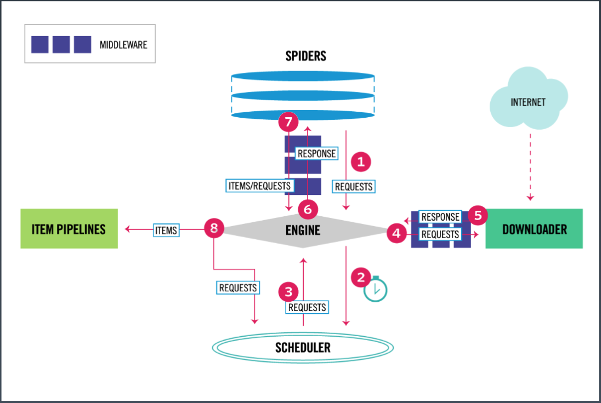

# Scrapy框架

学习目标：掌握Scrapy框架的用法

## SOLID原则

为什么要学框架

SOLID 原则

- Single Responsibility Principle 单一职责原则：一个类仅有一个被修改的理由；解决方法大类拆小类
- Open / Closed Principle 开闭原则：类对扩展开放，对修改封闭。
- LiskovSubstitution Principle 里氏替换原则：子类可以替代父类。如 996 超市，普通用户和 vip 都子类
- Interface Segregation Principle 接口分离原则：不多不少刚刚好
- Dependency Inversion Principle 依赖倒置原则：高层模块不能依赖低层模块

## Scrapy框架的安装和架构

Scrapy框架介绍



Scrapy核心组件：

- 引擎        -无需修改
- 调度器      -无需修改
- 下载器：下载，内容返回给引擎，基于 urllib
- 爬虫器：解析（xpath、bs4 等）
- 管道：数据保存，后面接数据库、文件、redis等，或存多份等
- 下载器中间件 -无需修改
- 爬虫器中间件 -无需修改

一般使用中，只需要改爬虫器和管道：

- 引擎        -无需修改
- 调度器      -无需修改
- 下载器      -无需修改
- 爬虫器      -需要修改
- 管道        -需要修改
- 下载器中间件 -无需修改
- 爬虫器中间件 -无需修改

流程：如爬取豆瓣书 top250，得到书的名

1. 引擎打开页面，放到 spidder
2. 丢到schdule
3. schdule 发现有任务，告诉引擎
4. 引擎发出 request，download 去下载

## 安装

win 需要 c++ build tools

MAC：`conda install scrapy` 或 `pip install scrapy`

## 创建

先创建一个项目：

```sh
$ scrapy startproject demo0
New Scrapy project 'demo0', using template directory '/Users/s1/anaconda3/lib/python3.7/site-packages/scrapy/templates/project', created in:
    /Volumes/S1-Document/GIT/Python000-class01/Week_03/G20200389010137/demo0

You can start your first spider with:
    cd demo0
    scrapy genspider example example.com


#生成文件如下：
$ cd demo0
$ tree
.
├── demo0
│   ├── __init__.py
│   ├── __pycache__
│   ├── items.py
│   ├── middlewares.py
│   ├── pipelines.py
│   ├── settings.py
│   └── spiders
│       ├── __init__.py
│       └── __pycache__
└── scrapy.cfg

4 directories, 7 files
```

用模板创建 spider：

```sh
cd demo0
scrapy genspider example example.com

$ tree demo0
demo0
├── __init__.py
├── __pycache__
│   ├── __init__.cpython-37.pyc
│   └── settings.cpython-37.pyc
├── items.py
├── middlewares.py
├── pipelines.py
├── settings.py
└── spiders             # 新增固定的目录名
    ├── __init__.py
    ├── __pycache__
    │   └── __init__.cpython-37.pyc
    └── example.py      # 新增
```

运行：

```sh
scrapy crawl example
scrapy crawl --nolog example    # 不打印 debug 日志

# 或
cd spiders
scrapy runspider example.py
scrapy runspider --nolog example.py # 不打印 debug 日志
```

## spider

example.py：

```python
# -*- coding: utf-8 -*-
import scrapy


class ExampleSpider(scrapy.Spider):
    name = 'example'
    allowed_domains = ['example.com']    # 爬取的广度，比如通过微信、百度再访问。深度在 settings.py 设置 DEPTH_LIMIT 参数
    start_urls = ['http://example.com/'] # 没设置的话是第一个页面，返回的结果 response 传给 parse 方法

    def parse(self, response):
        print(response.text)
        print(response.url)
        str(response.body, enconding='utf-8')   # 解决乱码
```

windows 解决乱码：

```python
import scrapy
import sys, io
sys.stdout = io.TextIOWrapper(sys.stdout.buffer, encoding='gb18030')
```

## URL管理器、数据存储器、控制调度器

## Scrapy的管道功能
