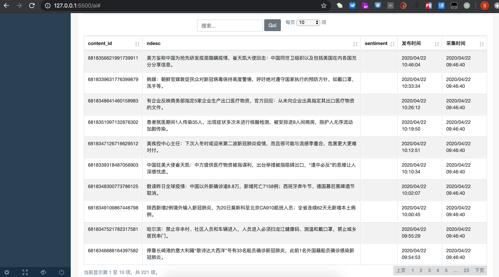
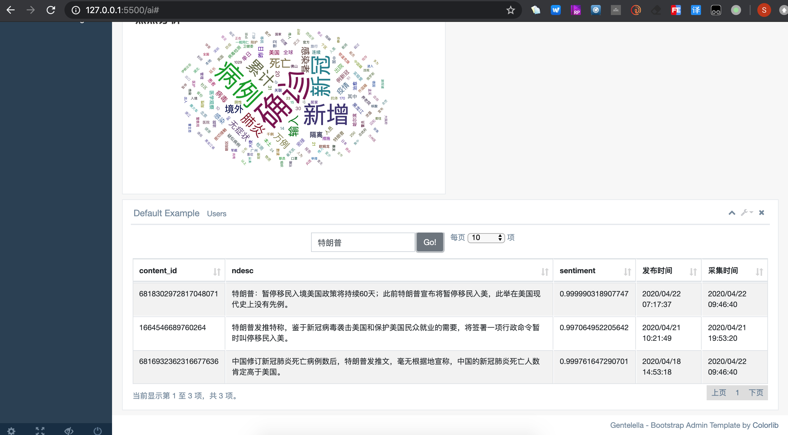
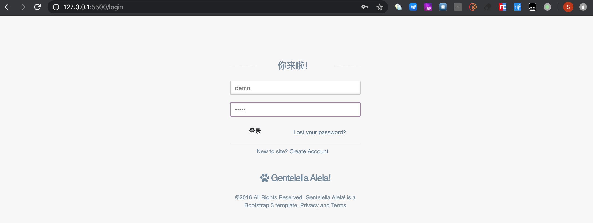
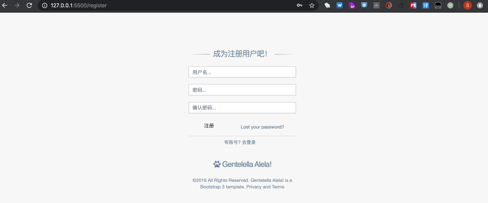
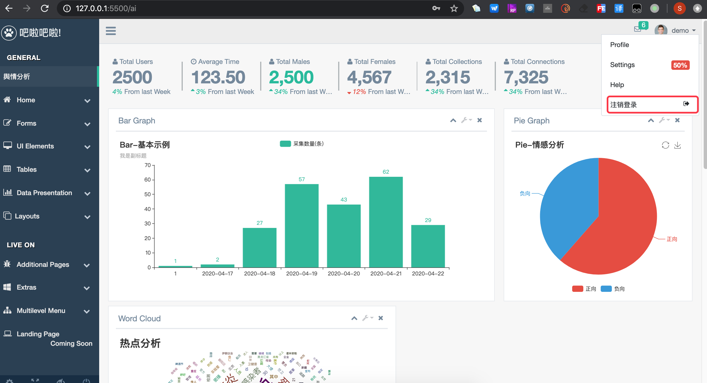

# 学习笔记

## 作业

1. 使用 scrapy框架 爬取微头条最新疫情进展并入库，程序在 News 目录下，目前只是用 crontab 定时调度，采集最近两天的数据，设置了 content_id 唯一性避免重复入库，但存在重复采集的缺陷。数据保存在 news 表
2. 将数据结果存入数据库，由于选取的数据比较规整，未进行过滤清理，在后面数据分析的过程中有使用 Pandas 进行数据处理和转换。
3. 对数据进行情感分析并存入 sentiments 表，content_id与 news表的 content_id 外键关系。程序在flask06-gentelella/ds.py，定时调度。抽取还没有进行情感分析的数据进行分析并入库。
4. web 界面采用 flask + 其它 bootstrap 模板，实现了登录、注销、创建账号功能。默认用户名密码demo/demo
5. 图形展示采用 pyechars 进行展示：实现了柱状图、饼图、词云展示，并且采用 ajax get 方式获取数据，并定时更新页面数据
6. 表格展示，使用 datatables 插件，实现了服务端分页展示，关键字搜索功能

效果如下：

柱图、饼图效果：

词云效果：

表格分页效果：

表格关键字搜索效果：

登录效果：

创建账号效果：

注销登录效果：

## 知识体系

- 语言本身
  - 数据类型
    - None
    - 数值
      - int
      - float
      - complex
    - 序列：切片
      - 字符串
      - 列表
      - tuple
      - range
      - buffer
    - 映射
      - dict
    - 集合
      - set
    - 可调用类型
      - builtin function
      - builtin method
      - class __call__
      - function
      - instance
      - module
    - 类
      - class
  - 流程控制
    - for
    - if
  - 类
    - 继承
    - 重载
    - 多态
  - 可执行对象
  - 异常处理

- 特殊用法
  - 第三方库
  - 推导式
  - 装饰器
  - 魔术方法

- 理论上
  - 设计模式

- 底层技能
  - 多进程
  - 多线程
  - 协程

- 底层理论
  - tcp 协议
  - http 协议

- 外延技能
  - 数据库
  - CMDB
  - mysql + flask + 搜索
  - 队列
  - 缓存

- 行业技能
  - 采集 - 清洗 - 存储 - 格式和内容的处理 - 展示

重点、难点
