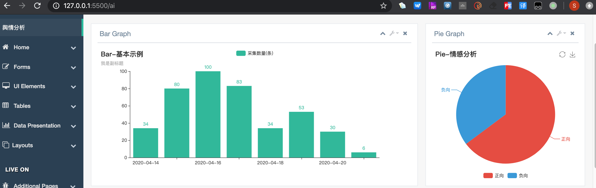
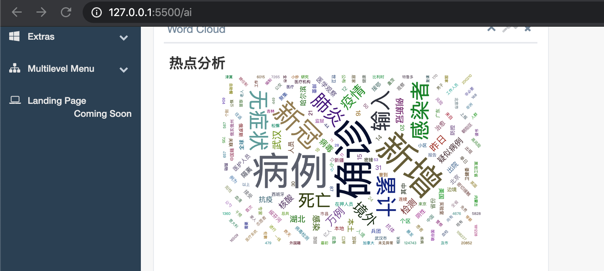
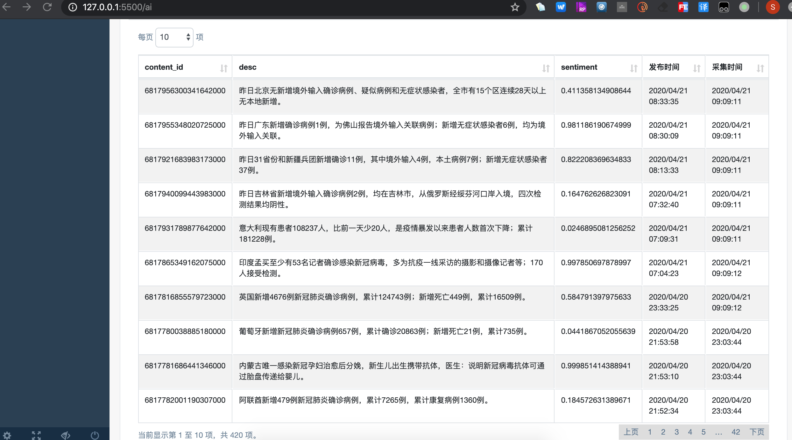

# 学习笔记

## 作业

效果如下：

1. 使用 News(scrapy框架) 爬取微头条最新疫情进展并入库
2. 使用 Flask06/ds.py 进行情感分析并入库
3. 使用 flask + pyechars 进行展示：实现了柱状图、饼图、词云、表格分页展示
4. 套用了其它 bootstrap 模板

## 知识体系

- 语言本身
  - 数据类型
    - None
    - 数值
      - int
      - float
      - complex
    - 序列：切片
      - 字符串
      - 列表
      - tuple
      - range
      - buffer
    - 映射
      - dict
    - 集合
      - set
    - 可调用类型
      - builtin function
      - builtin method
      - class __call__
      - function
      - instance
      - module
    - 类
      - class
  - 流程控制
    - for
    - if
  - 类
    - 继承
    - 重载
    - 多态
  - 可执行对象
  - 异常处理

- 特殊用法
  - 第三方库
  - 推导式
  - 装饰器
  - 魔术方法

- 理论上
  - 设计模式

- 底层技能
  - 多进程
  - 多线程
  - 协程

- 底层理论
  - tcp 协议
  - http 协议

- 外延技能
  - 数据库
  - CMDB
  - mysql + flask + 搜索
  - 队列
  - 缓存

- 行业技能
  - 采集 - 清洗 - 存储 - 格式和内容的处理 - 展示

重点、难点
